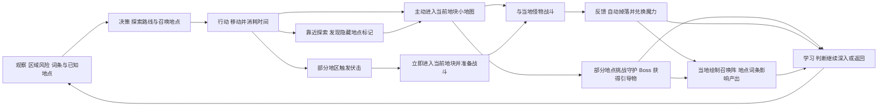

# 大地图探索与小地图关联策划案

版本：v0.5。状态：团队讨论中。本文依据已明确需求整理；标注“建议”的内容尚未定案。本版明确玩家地图没有六边形分界线，行动不受格子限制，仅进入小地图按所在隐藏地块判定；并制作 v02 演示视频。既有 v01 视频包含场景采集，保留为旧版示意。

## 玩法目的

玩家通过大地图选择探索方向，付出移动时间，进入当前六边形地块对应的小地图，与当地怪物战斗。普通掉落和可复刷素材统一兑换为魔力，用于召唤新的召唤阵。玩家可以在小地图中选择于当地绘制召唤阵，地点特性词条影响产出；部分城镇、遗迹地块的引导物需击败对应守护 Boss 获得。引导物是独立阵眼道具，获得后可无限复用，不消耗、不计入普通掉落兑换。

核心体验是：玩家结合旅行时间、地点词条、战斗风险与探索发现，选择在哪里绘制召唤阵，并通过挑战守护 Boss 扩充可复用的引导物。

挑战来自时间成本、召唤资源需求、伏击及未知地点的信息不确定性；玩家的核心动作是规划路线、探索发现、选址召唤与选区战斗。不要求额外的场景采集操作。

## 已明确的需求

1. 玩家能够在大地图上移动，移动消耗游戏内时间。
2. 大地图支持缩放，方便查看整体区域与局部位置。
3. 玩家随时可以从大地图进入小地图，不需要抵达专门的入口节点。
4. 大地图在设计层面由六边形地块组成，玩家看到完整连续地图且没有六边形分界线。行动不受格子限制；仅进入小地图时按当前所在的地块确定，场景布局与该地块有关。
5. 大地图存在不同难度的地区，探索目的包括战斗获取魔力资源和取得关键阵眼引导物。
6. 点击行动后显示移动路线，已走过的部分为实线，尚未抵达的部分为虚线。
7. 移动期间可随时按空格暂停移动，并更改目的地。
8. 不设场景素材采集；素材由与当地怪物战斗自动掉落。普通掉落和可复刷素材统一兑换为魔力，用于召唤新的召唤阵；独立引导物不纳入兑换。
9. 在部分地区行动时可能遭遇怪物伏击，立即进入当前位置对应的小地图，并准备进行战斗。
10. 使用 [Watabou's Procgen Arcana](https://watabou.github.io/) 制作、编辑大地图。具体工具入口与导出方式由制作试样确认。
11. 每个地点有特性词条，例如【干旱】【沙】【潮湿】，会对当地召唤阵的产出产生影响。
12. 玩家可在小地图中选择于该地绘制召唤阵。
13. 部分城镇、遗迹等地块需击败对应地块的守护 Boss，才能获得其引导物；不是所有地块都必须有 Boss。
14. 引导物为独立道具，获得后可无限复用且不会消耗。
15. 地块上的部分地点标记直接显示，例如城镇、奇观；部分标记需要靠近探索才显示具体位置，例如未知洞穴。

## 核心流程

主要取舍是旅行时间、区域风险、魔力收益和当地词条带来的召唤倾向。大地图承担路线选择与地点发现，小地图承担探索、战斗及当地召唤；本案只定义内容关系，不展开复杂生成算法。

## 大地图制作工具

按用户指定，使用 [Watabou's Procgen Arcana](https://watabou.github.io/) 制作、编辑大地图。该主页是工具集合，其中 Realm 链接到区域地图工具 [Perilous Shores](https://watabou.github.io/perilous-shores/)；建议从此入口试样，具体编辑能力、导出格式与素材使用条件需在制作时核实。

工具负责地图底图与地理结构的制作；隐藏六边形地块、地点词条、标记发现状态、玩家移动、路线、时间、伏击及小地图关联仍是游戏内玩法，不假定网站自动提供这些功能。地图底图与隐藏地块需要对应，但无需向玩家展示完整格线或把进入限制为固定入口。

## 六边形地块与玩家地图表现

设计层面以六边形地块为地点内容的组织单元，玩家视角则是完整连续的地图，不以裸露的六边形方块拼图作为默认表现。

当前地块决定进入哪张小地图，也承载地点特性、当地敌人、难度、伏击配置及城镇、奇观、洞穴或遗迹等地点内容。守护 Boss 和引导物获取状态关联到对应地块。底图上的位置不需要为每个坐标单独生成一张小地图。

同一地块内的不同位置进入时，都进入该地块对应的小地图；跨入另一地块后使用新地块内容。主动进入与被伏击进入遵循同一归属规则。小地图内部出生点是否随精确位置或来向变化，另行确定。

行动不受六边形格子限制，不按格跳转、不要求沿格中心移动，也不将进入下一格作为可暂停或可进入小地图的唯一时机。路线仍保持已走实线、未走虚线。隐藏地块仅用于进入小地图的归属及地点内容组织，不限制玩家移动路径；是否有地形通行限制另行确定，不能把“无格子限制”解释为可穿过所有障碍。旅行计时细则仍待试样确认。格边界附近应明确唯一的当前地块，避免同时进入两张小地图。

## 地点标记与探索发现

地点标记表达地块中的具体地点，标记的可见性与地点特性词条是两个不同概念：隐藏标记的地点仍然存在，也仍有自己的词条与内容，不因玩家尚未发现而变成空地块。

| 标记类型 | 已明确的显示规则 | 示例 |
| --- | --- | --- |
| 直接显示的地点 | 在大地图上显示地点标记及位置 | 城镇、奇观。 |
| 需探索发现的地点 | 靠近探索后才显示具体位置 | 未知洞穴等。 |

“某地有隐藏地点”“具体标记已被发现”“守护 Boss 已击败”“引导物已取得”应分别记录。发现地点不等于击败守护 Boss，也不等于直接领取引导物。城镇、奇观、洞穴、遗迹是否都配置守护 Boss，按具体地点设计，不由标记类型自动推定。

发现条件的具体范围、只需靠近还是另需探索操作、未发现时是否有模糊线索，尚待确认。建议发现后保持标记可见，并给出简短发现提示；缩放或再次进入地图不应把已发现标记重新隐藏。未发现地点的词条是否可预览，也需单独确定，不默认提前暴露其坐标。

## 地点特性词条与当地召唤

每个地点都需标记特性词条，至少纳入地点与召唤阵的策划关系，不能只作为背景描述。下列仅是方便整理的词条维度建议，不是最终词库：

| 维度建议 | 示例词条 | 用途 |
| --- | --- | --- |
| 干湿状况 | 【干旱】【潮湿】 | 描述当地环境状态。 |
| 地表介质 | 【沙】 | 描述地点的主要地表特征。 |

词条允许来自不同维度，例如【干旱】【沙】可以组合；同一范围内相互矛盾的词条如何排除，以及同一地块内是否存在有不同词条的子地点，待后续词库设计确认。首版建议先按地块共用一组词条验证，避免引入小地图内部复杂分区。

玩家进入小地图后，可以选择在该地绘制召唤阵。关系为：当前地块／地点 → 当地词条；魔力 → 召唤新的召唤阵；已获得引导物 → 可复用的阵眼配置；地点词条 → 影响召唤阵产出。地点词条不替代引导物，引导物也不抹去地点影响。

建议在绘制召唤阵前显示当前地点词条，帮助玩家理解选址意义。词条具体影响形态、属性、产出范围还是出现倾向，叠加方式和引导物优先关系均尚未定案；不擅自确定【沙】必产蛇形、【潮湿】必产某类怪物或固定概率公式。

是否允许战斗中绘制、绘制需要多少时间、同地可绘制数量、召唤阵是否持久保留，需另行确认。验证版可先在非战斗状态展示绘制入口和词条对产出的一个占位影响，不等于限制正式玩法只能在战斗外召唤。

## 大地图移动与时间

大地图显示玩家当前位置。玩家指定目的地后点击“行动”，开始移动，并显示对应路线。目的地如何选取以及行动控件的位置，可在界面试样中确认。

移动过程中明确显示时间推进。建议以实际移动距离和旅行速度计算消耗，避免画面卡顿、缩放操作或切换界面额外扣除旅行时间。首版可使用统一速度，地形对速度的影响留待后续。

按空格暂停时，玩家停止移动。建议同时停止本次旅行的时间消耗；已经消耗的时间不退回。大地图其他时间机制是否继续运行尚未确定。为便于首轮验证，建议停留、查看信息和缩放操作本身不额外消耗旅行时间。小地图探索与战斗是否消耗同一时间、时间是否进一步影响寿命和事件，也需另行确认。

## 路线显示与暂停改道

点击“行动”后，初始计划路线显示为虚线。随着玩家前进，走过的部分逐段转为实线，剩余部分保持虚线。虚实分界跟随玩家当前位置；抵达目的地后，本次路线全部成为实线。

移动中随时按空格，玩家停在当时位置，路线保留，界面明确显示“移动已暂停”。暂停期间可以查看和缩放地图，以及更改目的地。

改道建议按以下规则处理：

- 新路线从暂停时的实际位置开始，不能从原出发点重新移动。
- 已走过的实线保留；原目的地对应的剩余虚线被新目的地路线替换。
- 新增的未走路线仍为虚线，原有时间消耗保留；恢复移动后只为实际继续行走的部分消耗时间。
- 建议更改目的地后保持暂停，由玩家再次点击“行动”确认移动；空格是否兼作恢复键待确认。

本次行程的实线保留到改道后，方便理解实际走向。多次行程是否累计保留历史路线、是否允许清除，尚未确定。实线与虚线在地图缩放后应仍可辨认，不能因缩放改变路线与实际位置的对应关系。

例：从 A 前往 B，在 C 按空格暂停；A 到 C 显示实线，C 到 B 显示虚线。改为前往 D 后，保留 A 到 C 的实线，将 C 到 B 的虚线替换成 C 到 D 的虚线。确认行动后，C 到 D 随移动逐段转成实线。

## 地图缩放

缩小时便于辨认区域分布、难度和探索方向；放大时便于判断玩家具体位置及附近地理特征。缩放只改变观察尺度，不改变玩家位置、旅行距离和时间消耗速度。

玩家标记与“进入当前区域”操作在允许的缩放范围内保持可识别。具体缩放倍率与是否支持拖动画面，由首版体验确定。

## 随时进入小地图

进入操作始终针对玩家当前实际位置所属的六边形地块，而不是鼠标指向的远处地块，也不依赖固定入口。已显示城镇、奇观或发现洞穴等标记，不会将这些标记变成所有小地图的唯一入口。

建议提供“进入当前区域”按钮。移动中按下时，停止大地图移动并进入当时所属地块的小地图；缩放级别不影响地块归属。玩家实际能够到达的位置都应有对应的地块场景，地图边缘等特殊位置不能无提示失效。

暂停移动时也可进入当前位置的小地图。建议返回大地图后保留已走实线与剩余计划路线，并保持移动暂停，避免玩家尚未操作就继续旅行；这一返回行为待用户确认。

建议离开小地图后返回原大地图位置，并保留已取得物品。退出是否要求脱离战斗、是否随时允许撤离，以及失败后的返回方式，尚待确认。

## 当前位置怎样影响小地图

关联需要让玩家看得出来，不能只在内部记录一个地点编号。当前六边形地块提供所属地区、主要地理特征及地点词条，小地图据此呈现场景结构与内容倾向；相同地块内不要求每个精确坐标对应不同布局。

| 大地图位置信息 | 小地图应体现的内容 | 示例，仅用于说明 |
| --- | --- | --- |
| 所属环境区域 | 主体地形和场景风貌 | 林地区域有树木形成的空间，开阔区域拥有更多通行余地。 |
| 地点特性词条 | 当地环境说明及召唤阵产出的影响依据 | 【干旱】【沙】组合；具体影响另定。 |
| 附近地理特征 | 主要通路、边界与障碍关系 | 靠近河流时出现对应水岸；道路交会处体现分岔。 |
| 区域难度 | 遭遇强度或探索阻力 | 较危险区域的敌人组合更难处理，进入前有风险提示。 |
| 当地怪物与收益 | 敌人类型及战斗掉落对应的魔力收益 | 不同地区由当地怪物提供不同战斗收益，兑换比例另定。 |
| 地点及发现状态 | 城镇、奇观或洞穴等内容及可见标记 | 部分标记直接显示，未知洞穴靠近探索后显示具体位置。 |
| 守护 Boss 与引导物 | 部分地点的挑战目标与取得状态 | 对应遗迹地块的守护 Boss 被击败后，获得其引导物。 |

首版建议保留大地形和通路关系的一致性，允许小物件和遭遇存在有限变化；暂不要求大地图与小地图逐块等比例复刻。相邻位置可以共享相近布局，但跨入明显不同区域时应有可感差异。

同一地块重复进入时，普通敌人的刷新规则尚未确定。可复刷素材不等于进出小地图就立即刷新敌人。验证版建议同一地块保持主要布局一致；每次有效战斗只结算一次，敌人按后续确认的规则刷新后可再次战斗获取魔力。引导物获得后无需复刷补充，使用不消耗；Boss 是否刷新及是否可获得重复引导物另定。

## 移动中遭遇伏击

部分地区行动时可能被当地怪物伏击。触发时立即中断大地图移动，按触发瞬间实际位置所属的六边形地块进入小地图，准备战斗；不等待抵达目的地，不弹出是否进入的选择。

建议流程：显示“遭遇伏击”提示 → 停止旅行 → 进入当前地块场景 → 敌我单位就位并进入战斗准备。准备阶段是否需要玩家确认、是否允许布阵、持续多久，尚未定案；不默认切图完成后立即开始攻击，也不额外规定伏击伤害。普通伏击不自动等于遭遇该地块的守护 Boss。

建议保留已走实线、剩余虚线和已消耗时间；战斗结束返回触发位置，保持移动暂停，避免自动继续前进再次遇袭。失败、逃离与返回规则另定。

伏击地区范围、概率、判定频率和是否显示风险提示待确认。首版建议只在实际移动时判定，暂停、缩放和查看信息不重复触发；同时避免切图或返回瞬间重复触发同一伏击。这些属于验证建议，不是已确定的正式规则。

## 区域难度与探索收益

建议在大地图提供可理解的风险提示，例如区域难度等级及代表性危险说明，让玩家能够主动选区，而非进入后才发现无预警的难度跳变。

不同地区的探索价值来自战斗魔力收益、风险、影响召唤产出的地点词条、隐藏地点发现及引导物挑战。建议低难地区提供基础魔力来源，高难地区提供不同的收益与风险取舍；不预先规定“所有高难地区都掉引导物”或“高难收益效率一定更好”。具体敌人、伏击分布、词条影响和掉落兑换表另行设计。

低难区帮助玩家理解战斗、掉落与兑换流程；高难区检验玩家是否愿意为魔力收益或引导物承担更大风险。探索失败的魔力、物品损失与时间代价尚待确认。

## 战斗掉落、魔力与引导物

| 类型 | 已明确定位 | 建议表现 | 尚待确定 |
| --- | --- | --- | --- |
| 普通掉落与可复刷素材 | 与当地怪物战斗后自动掉落，统一兑换为魔力；不设场景采集点 | 显示本次掉落和兑换所得魔力，无需逐件拾取 | 掉落时机、兑换比例、兑换自动结算还是统一操作。 |
| 魔力 | 用于召唤新的召唤阵 | 显示当前魔力和召唤阵所需魔力 | 召唤阵成本、是否有储存上限、失败损失。 |
| 引导物 | 独立的关键阵眼道具，获得后无限复用且不消耗；部分地点通过击败对应地块的守护 Boss 获得 | 与魔力、普通掉落分开记录；显示已拥有、可重复使用 | 具体召唤影响、替换规则、是否可跨阵同时使用及重复获得的处理。 |

引导物不自动等同于通往小地图的钥匙。玩家进入小地图无需先持有引导物；它的关键作用发生在阵眼配置环节。当前也不假定它必定召唤某个固定怪物。

兑换范围现已明确：普通掉落与可复刷素材进入魔力体系；引导物作为独立道具保留，不兑换为魔力，不因配置或使用召唤阵而消耗。

部分城镇、遗迹地块的获取链为：找到地点 → 进入对应地块小地图 → 击败该地块守护 Boss → 获得引导物 → 后续反复用于阵眼配置。Boss 条件限制的是获得引导物，不是进入该地块小地图的资格。没有击败守护 Boss 时不能通过普通掉落结算或反复进出提前领取其引导物。

## 首版验证内容与验收

建议先用少量隐藏六边形地块支撑一张完整可缩放地图，覆盖两个不同环境与难度的地区。内容包含：同格不同位置进入、跨格进入、两组不同地点词条、一个直接显示的城镇或奇观标记、一个需靠近探索才显示的洞穴标记、一场普通战斗掉落兑换测试、一个伏击测试、一个守护 Boss 与独立引导物，以及当地绘制召唤阵的占位测试。测试触发条件和产出变化只用于验证，不是正式概率或生成公式。

这一完整版本增加了隐藏地块、标记发现、词条、当地召唤、Boss 和引导物，不应直接承诺全部塞进原三至四天计划。建议顺序为地块关联与切换 → 方块战斗的伏击及收益 → 词条与召唤关系 → 标记发现与 Boss 引导物。物理怪物生成仍与方块战斗测试分开。

- 移动可见地推进游戏时间；同样旅行不因缩放而改变时间成本。
- 点击行动后出现虚线路线，移动中已走部分逐段转为实线，抵达后本次路线成为实线。
- 移动中按空格立即暂停，改目的地后新虚线从实际暂停位置起算，已走实线和已消耗时间不回滚。
- 按验证版建议，暂停与改道期间不新增旅行时间消耗；恢复后继续按实际移动消耗。若采用其他时间规则，应先确认并更新验收。
- 同一六边形地块内不同位置及移动中发起进入，均进入该地块小地图；跨格后按新地块进入，不能误用目标地块。
- 玩家看到完整地图，地图不显示六边形分界线；行动不受格子限制，隐藏格边界只参与小地图归属判断及地点内容组织。
- 小地图布局与所属地块的环境和地点内容有可解释联系。
- 玩家能在进入前辨认区域风险，并在进入后感知对应难度。
- 不出现素材采集点；战斗后自动产生掉落，并可统一兑换魔力。同一战斗不重复结算，合法复刷战斗可再次获得收益。
- 魔力获取及用于召唤新的召唤阵有明确反馈；引导物独立保留、不兑换，重复用于阵眼配置后仍存在且可再次使用。
- 每个测试地点具有词条；当地绘制召唤阵读取当前地点词条，测试不同词条时能展示已配置的产出差异，不擅自定义正式算法。
- 守护 Boss 未击败不能获得对应引导物；击败后可取得，取得状态在返回与再进入后保留。该限制不阻止首次进入小地图。
- 城镇、奇观测试标记直接可见；隐藏洞穴标记在满足探索条件后显示具体位置，不提前泄露，发现本身不自动领取奖励。
- 移动触发伏击后立刻进入当时所属地块的小地图，敌我准备战斗；与主动进入共享地块归属。
- 缩放、进入和返回不会使玩家位置错乱或重复生成玩家。

试玩时请玩家说明“为什么在这里绘制召唤阵”“怎样发现这个地点”“魔力与引导物有什么区别”“获得此引导物需要做什么”。能回答这些问题，才说明地点、探索与召唤的关系可理解；仅能切换场景不代表玩法成立。

熟练玩家是否能通过选区、词条选址及改道提高探索效率，是策略深度观察点，不预设提升百分比；不同地区的词条、收益和伏击风险应支持不同路线。引导物的可复用性使首次挑战具有持续价值，而不要求重复挑战来补充消耗。节奏上观察伏击准备是否足以理解情况，并在返回后的暂停阶段提供重新规划机会，具体时长通过测试确定。

## 操作与状态边界

| 操作或事件 | 前置状态 | 结果 |
| --- | --- | --- |
| 点击行动 | 大地图已选择目的地 | 开始移动，显示虚线并消耗旅行时间。 |
| 空格暂停 | 大地图移动中 | 停在当前实际位置，可修改目的地。 |
| 主动进入 | 玩家位于大地图 | 进入当前六边形地块对应的小地图。 |
| 靠近探索发现地点 | 满足该隐藏地点的发现条件 | 在大地图上显示该地点具体位置；发现不等于获得引导物。 |
| 怪物伏击 | 部分地区行动时触发 | 中断旅行，立即进入当前地块小地图并准备战斗。 |
| 战斗掉落兑换 | 产生有效战斗掉落 | 统一兑换为魔力；触发时机待定。 |
| 当地绘制召唤阵 | 玩家处于小地图，满足待定绘制条件 | 使用当地词条影响产出；魔力成本和绘制时间待定。 |
| 击败守护 Boss | 对应地块有该引导物获取条件 | 获得独立引导物，后续无限复用、不消耗。 |

状态关系：大地图待命／暂停 → 移动 → 主动进入或伏击进入 → 小地图探索／战斗准备 → 战斗 → 结算 → 返回大地图。准备是否必须手动确认、返回是否保持暂停均按上文区分已定需求与建议。

独立记录的内容状态：地点标记未发现／已显示；守护 Boss 未击败／已击败；引导物未拥有／已拥有。地点词条属于环境内容，不能与以上进度状态混为同一组词条。

## 视频修订与待确认项

需要进一步确认的是：旅行时间细则与地形通行限制；地点发现范围及探索操作；未发现地点的词条可见范围；词条具体产出影响与叠加规则；绘制召唤阵的条件和时间；暂停期间其他时间机制；空格是否兼作恢复；战斗准备、伏击、退出与失败；普通怪物及 Boss 刷新；兑换时机与比例；引导物的具体召唤影响及是否可跨阵同时使用。行动不受格子限制，以及引导物独立、无限复用、不消耗均已定，不再列为待确认。

已生成的 `玩法演示/大地图探索_路线暂停改道_效果示意_v01.mp4` 保留为旧版，不覆盖。v02 路径为 `玩法演示/大地图探索_自由移动与当地召唤_效果示意_v02.mp4`，使用自绘无格线示意底图，不是 Watabou 导出的最终地图或游戏实录。

v02 演示顺序：城镇／奇观直接可见 → 缩放与自由移动 → 实虚线路线及暂停改道 → 靠近发现洞穴 → 按当前隐藏地块进入 → 战斗掉落兑换魔力 → 地点词条与当地绘制召唤阵 → 移动伏击并进入战斗准备 → 挑战遗迹守护 Boss → 取得并两次使用同一独立引导物。全片不叠加六边形格线；隐藏地块归属由制作文件内部判定，玩家画面仅显示区域名称。

演示假设：暂停停止旅行计时；掉落自动兑换；发现范围、魔力数值、绘制时间与产出为占位。首次和后续产出仅表达词条参与召唤，不定义固定的词条—怪物对应关系。方块代替怪物，守护 Boss 攻击、准备阶段及难度不代表最终数值设计。
