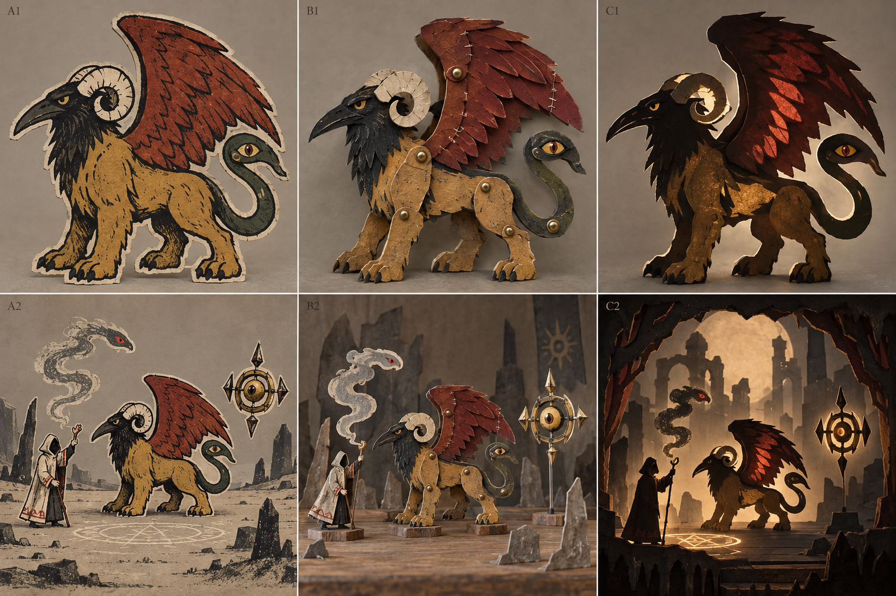
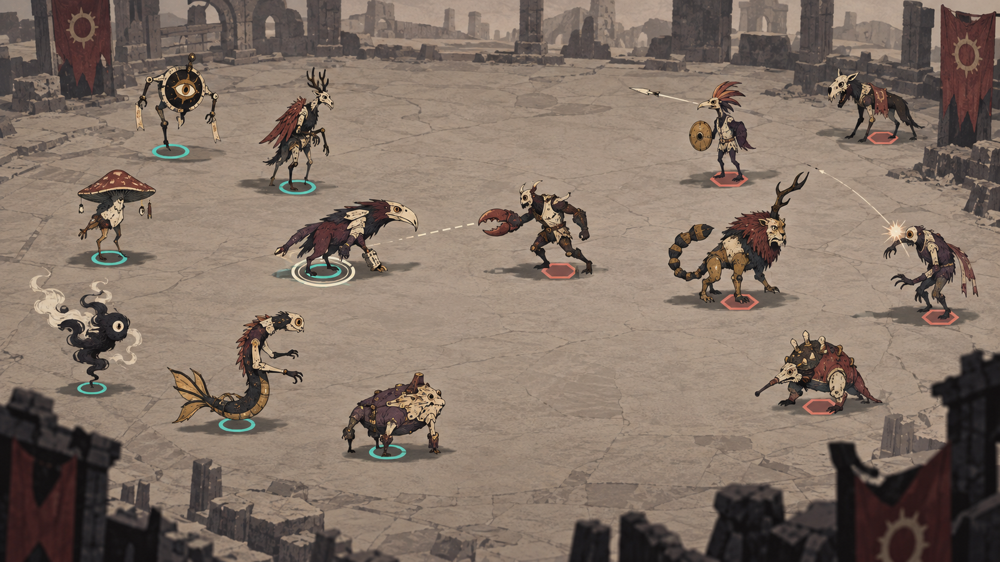

# 怪物自动战斗美术方向与参考

更新日期：2026 年 10 月 4 日  
文档状态：**团队讨论与首轮试样依据，非最终美术定案。**

本文面向策划、美术与程序。它说明项目的目标体验、取舍理由，以及自动战斗原型中的验证方式。完整探索过程保留在 `Lworking document`；本文件与同级“美术参考图片”是公共协作入口。

---

## 1. 快速结论

### 推荐方向

**以“粗轮廓、有限配色、拼接立片／关节纸偶”的怪物，置于低对比、少信息的战场中。**

- 怪物是第一阅读对象：先读到单只单位、阵营、朝向和攻击意图。
- 纸偶的拼接感来自纸片分层、统一连接件、局部错位与切边，不来自无节制的复杂细节。
- 纸剧场的分层、遮挡和投影主要服务场景外围与召唤演出，不与战斗信息竞争。
- “术士装配的神话造物”可作为美术表达的工作假设：允许异质肢体、不对称比例和显露连接件；**它不是已经确认的世界观设定。**

### 两张示意：先用它们说明方向

| 纸偶拼接语言 | 自动战斗信息层级 |
| --- | --- |
|  |  |
| **讲解重点：** 借鉴 B1 的分层纸板、可读铜钉与局部缝线；外轮廓优先于内部装饰。A1 与 C1 可分别用来对比“平面色块”和“舞台氛围”，不是要求把单位做成真实厚纸模型。 | **讲解重点：** 战场压低对比，单位凭轮廓、头部／核心、脚点与阵营底标被快速识别；弹道与命中只承担短促的战斗反馈。该图站位较疏，仅说明信息层级，不代表同屏数量或最终场景。 |

### 优先级

1. 目标显示尺寸下，单位、敌我、朝向、攻击与受击可辨。
2. 程序组合后仍属于同一视觉体系，接缝像有意装配。
3. 多单位重叠、移动和攻击时，轮廓稳定、不闪烁、不误导站位。
4. 最后才增加纸纹、干笔、磨损等装饰性材质。

项目中的身体、头、手脚和尾部会由程序组合，接缝不一定连续；同一战场还有多个敌我单位自主索敌与攻击，且大部分候选素材由 AI 生成。因此，单张高清概念图的完成度不能替代战斗中的可读性。

---

## 2. 目标体验与视觉分工

| 层级 | 应传达什么 | 推荐表现 | 避免 |
| --- | --- | --- | --- |
| 单位主体 | “这是什么、朝哪里、正在做什么” | 完整大色块、强外轮廓、稳定头部／核心 | 所有小部件等强度描边、过碎纹理 |
| 连接与异质性 | “它由不同部件装配而成” | 少量统一的铜钉、套环、缝线、接片或遮挡 | 每个接缝各自使用不同材质或装饰 |
| 阵营与站位 | “谁是友军、谁是敌人、脚点在哪” | 独立底标、落地中心、颜色与形状双编码 | 只依赖身体颜色；用尾翼或烟雾代替脚点 |
| 战斗反馈 | “将要攻击、命中、受击、危险程度” | 头部转向、短促起手、清楚弹道与命中点 | 全场目标线、长期大范围粒子遮挡 |
| 战场与演出 | “这是神话战场，且有纸材层次” | 低对比地面、外围纸剧场、召唤时的层叠／投影 | 在战斗中心放高反差建筑或厚重框景 |

### 固定阅读顺序

建议任一设计尽量保证：**轮廓 → 主体色块／核心 → 头部或朝向锚点 → 阵营底标 → 动作与特效 → 内部材质。**

若缩小至游戏内尺寸后只能保留少量信息，优先保留前四项。无定形、蛇形和几何体同样必须提供稳定“视觉锚点”，例如核心、眼、朝向尖端或主要运动端。

---

## 3. 单位造型与动作规范

| 部分 | 必须做到 | 可选表现 | 不建议 |
| --- | --- | --- | --- |
| 身体 | 至少一块连续大色块，成为单只单位视觉中心 | 局部纸层、色块错位、切边磨损 | 整体被零散肢体、纹理或装备切碎 |
| 头部／核心 | 一眼能识别前方、视线或攻击端 | 眼、面具、鸟喙、发光核心、符号 | 与背景同对比度、长期被翅膀或尾部遮住 |
| 肢体／尾翼 | 根部可被身体和连接件遮挡；末端轮廓简洁 | 不对称、异质来源、分段动作 | 所有末端同时尖锐、同时粗描边 |
| 关节／接缝 | 使用少量可复用的连接语言；错位像装配而非错误 | 铜钉、套环、缝线、接片、烟雾遮挡 | 每张素材各自发明一套连接方式 |
| 线条／材质 | 外轮廓强，内部线条为结构服务 | 轻度干笔、纸纹、局部磨边 | 密集内线抢走主体和攻击信息 |

### 动作

- 待机只做轻微呼吸、摆动或关节松动，保持站位与朝向稳定。
- 攻击要有清楚的前倾、收束、挥击或弹道起点；命中以短促反馈结束。
- 受击需有方向性或停顿，但不能让单位脚点漂移。
- 长尾、翼、烟雾和飘带是外观延伸，不可被当作碰撞中心或站位中心。

### 阵营标识与脚点

阵营标识独立于怪物种类和身体颜色。现有概念中的**青色圆圈**与**珊瑚红六边形**仅为示意，最终色、形和亮度待原型调整。实际规范为：

- 同时使用颜色与形状，不只依赖颜色；
- 底标围绕实际脚点／悬浮中心，不围绕整张立绘包围盒；
- 落地阴影若使用，应弱于阵营标识，不可被误读为另一只单位；
- 仅选中单位显示目标线或强提示，避免全场信息穿透。

---

## 4. 场景与纸剧场的使用边界

战斗区域是低对比、少细节的承托层。地面纹理可提供尺度和氛围，但不应与怪物主轮廓竞争。远景、外围建筑与旗帜可以承载纸材、废墟和召唤仪式等叙事信息。

纸剧场不是每个单位都必须携带的背景框，而是用于：

- 画面外围的前、中、后景层次；
- 召唤、登场、Boss 演出与转场；
- 强化纸材、切片与舞台质感。

不得让厚重舞台边框长期压进战斗核心区，也不得用高反差环境遮挡单位、底标、弹道或命中反馈。

---

## 5. 已有参考素材：用途与边界

所有下列图片位于同级 [美术参考图片](美术参考图片) 文件夹。它们用于沟通、拆解与建立验收语言，**不是最终资产、引擎截图，也不代表可直接复刻或直接拆分使用。**

### 5.1 四张项目概念对照

| 文件 | 可借鉴的维度 | 不作为生产结论的部分 |
| --- | --- | --- |
| [01 立片纸偶纸剧场对照](美术参考图片/01_立片纸偶纸剧场对照.png) | A 的粗轮廓与色块；B 的分层纸板、铜钉关节、局部缝线；C 的舞台层次与召唤氛围 | 真实厚纸模型感不等于游戏必须使用 3D 体积；场景框景不可遮挡战斗 |
| [02 木刻皮影粉笔探索](美术参考图片/02_木刻皮影粉笔探索.png) | A 的有限色版、图形化黑线和留白；B 的关节与分段；C 的烟雾形体锚点 | 粉笔式松散边缘不应直接用于所有战斗单位 |
| [03 拼贴蓝晒黑金探索](美术参考图片/03_拼贴蓝晒黑金探索.png) | D 的拼贴接缝和异质材料；E 的单色材质统一；F 的剪影与仪式感 | 蓝晒、黑金和复杂拼贴可留给特殊单位／演出，尚不确定为全局风格 |
| [04 多单位自动战斗概念](美术参考图片/04_多单位自动战斗概念.png) | 底标、脚点、异质部件、低对比战场、克制弹道 | 当前站位偏疏，尚未验证密集混战、实际碰撞、镜头缩小与性能 |

### 5.2 文件夹内补充实例

| 子目录 | 已观察到的参考价值 | 在本项目中的使用方式 |
| --- | --- | --- |
| [paper puppet](美术参考图片/paper%20puppet) | 可动纸偶的分段肢体、圆形关节、纸片边缘与层叠关系 | 规定“部件如何连接、关节如何被看懂”；不要求模仿具体人物或比例 |
| [monster](美术参考图片/monster) | 传统版画式异形怪物的清楚剪影、有限着色与不协调组合 | 支持神话怪物的异质性；仍须补足现代战斗中的朝向、脚点和阵营信息 |
| [environment](美术参考图片/environment) | 纸剧场的前中后景分层、柔和材质变化与环境边界 | 用作外围氛围和演出，不作为战斗区的高信息背景 |

### 5.3 参考使用规则

1. 每次只从一张图提取一个明确维度，例如“铜钉连接”或“低对比地面”，不要整体复制。
2. 新生成或外包素材必须在游戏镜头与实际显示尺寸下复核，不能只按原图审美通过。
3. 当某个参考与“单位、阵营、朝向、攻击可读”冲突时，优先满足玩法可读性。

---

## 6. B 方案：铜钉模块效果测试

本组以 [00 B方案铜钉模块底图](美术参考图片/Shader效果对照_B方案铜钉模块/00_B方案铜钉模块底图.png) 为共同输入：分层纸板、分段肢体、铜钉连接与红翼缝线。各图左侧是 BASE，右侧是单项强化；强度有意偏高，便于讨论，**并非 Godot 中的 shader 实测，也不是生产默认参数。**

| 效果 | 对照 | 目标 | 风险与验收重点 |
| --- | --- | --- | --- |
| 01 统一外轮廓 | [图](美术参考图片/Shader效果对照_B方案铜钉模块/01_统一外轮廓_强化.png) | 让整只怪物脱离背景 | 翼尖、爪、尾部连续；内部铜钉与接缝不可被粗边吞没 |
| 02 手绘笔刷描边 | [图](美术参考图片/Shader效果对照_B方案铜钉模块/02_手绘笔刷描边_强化.png) | 增强手工笔触 | 与 01 二选一比较；运动和缩小后不能跳动、发脏 |
| 03 干笔断墨遮罩 | [图](美术参考图片/Shader效果对照_B方案铜钉模块/03_干笔断墨遮罩_强化.png) | 表现颜料缺墨与刮痕 | 不能切碎大色块；眼与铜钉应清楚 |
| 04 纸张纤维材质 | [图](美术参考图片/Shader效果对照_B方案铜钉模块/04_纸张纤维材质_强化.png) | 统一纸材表面 | 缩小后若无贡献则不保留；不能造成闪烁噪点 |
| 05 切边磨损遮罩 | [图](美术参考图片/Shader效果对照_B方案铜钉模块/05_切边磨损遮罩_强化.png) | 强化独立纸片的切边 | 不得形成整圈白边，也不应切断关节连接 |
| 06 立片偏移投影 | [图](美术参考图片/Shader效果对照_B方案铜钉模块/06_立片偏移投影_强化.png) | 表现贴片与背景的轻微分层 | 这是贴片背后的偏移影，不是战场落地阴影；不能被误读为额外单位 |

**当前建议（待原型验证）**：先比较“01 统一外轮廓 + 少量 05 切边磨损”；02 是更强手绘感的替代候选；03 和 04 分别单项验证，不默认叠加全部效果。

---

## 7. AI 素材进入项目的最低标准

AI 生成用于快速获得候选造型，不能直接入库。每批素材先统一镜头角度、光线方向、外轮廓粗细、色彩范围、关节语言、相对尺度与透明边距，再进行筛选、结构修整和风格统一。

### 首轮素材包

- 少量主体即可：站立、四足、长躯、悬浮／无定形。
- 每个主体只验证一套清楚的头部／核心、一个攻击端和一套关节语言。
- 复杂巨物、复杂复合体先做轮廓与概念验证，不进入首轮批量生产。
- 每只试样附简卡：主形态、可替换部件、视觉中心、脚点、攻击端、必须保留与可删减特征。

### 入战斗试样检查

- [ ] 缩小到目标游戏尺寸，外轮廓仍清楚。
- [ ] 头部／核心和攻击端能区分前后。
- [ ] 阵营标识和脚点没有被肢体、尾部或特效遮住。
- [ ] 连接件有统一语言，组合后像有意装配。
- [ ] 纹理、描边和边缘在运动中没有闪烁。
- [ ] 多单位重叠时仍能分出个体，而非只剩混合色块。

---

## 8. 原型验证与验收

效果对照必须固定**同一底图、同一镜头、同一显示尺寸、同一背景**，一次只开关一个变量。AI 概念对照只用于提出假设，不能证明程序组合、运动、密集混战或性能可行。

### 验收顺序

1. **静态缩略图**：轮廓、头部／核心、阵营底标、脚点。
2. **单只移动与攻击**：朝向、起手、命中、受击、关节稳定性。
3. **程序组合**：不同头、躯干、肢体、尾部的接缝是否仍统一。
4. **小规模混战**：相互遮挡、弹道与目标信息是否清楚。
5. **目标同屏压力**：描边、材质、粒子与层叠是否造成性能或视觉噪声。

首要问题是：玩家能否快速分清单位、所属阵营、朝向和攻击反馈；接缝是否像有意的纸偶装配；描边、铜钉、纸纤维和磨损在运动中是否稳定；强调效果是否帮助阅读而不是制造噪声。

---

## 9. 分工与未决项

| 角色 | 本阶段职责 |
| --- | --- |
| 策划 | 明确体验优先级、分类边界、可读性验收和战斗信息层级 |
| 美术 | 定义造型、连接件、部件修整、色彩与风格统一；筛选 AI 候选 |
| 程序 | 验证组合、动作、显示顺序、材质效果与战斗性能 |

尚待原型确认、不可视为已定的内容：最大同屏数量、镜头距离、最终色板、连接件的唯一形式、材质效果强度、复杂主形态的首批范围，以及“术士装配”是否成为正式世界观。

## 10. 美术探索与量产计划

### 阶段目标

美术探索窗口仅保留 **3–5 天**。这段时间的目标不是积累大量“看起来不错”的概念图，而是用少量可比较的试样，把后续量产所需的视觉规则、部件标准和验收方式定清楚。

探索结束后，工作方式切换为：**按已确认的需求表填量，并在原型反馈中做针对性调整。**除非原型暴露出明确问题，不再重新开启整体风格探索。

### 3–5 天建议安排

| 时间 | 目标 | 应完成的内容 | 当天需要决定什么 |
| --- | --- | --- | --- |
| 第 1 天：锁定阅读规则 | 确认“先读什么” | 选定一组单位主体试样；在目标镜头下确认轮廓、头部／核心、脚点、阵营底标的优先级 | 是否采用粗轮廓、有限配色、拼接立片／关节纸偶作为全局基础 |
| 第 2 天：锁定拼接语言 | 让程序组合有统一外观 | 用同一主体试验头、躯干、肢体、尾部的替换；比较铜钉、缝线、接片等少量连接语言 | 保留哪些连接件；哪些部件必须有稳定视觉锚点 |
| 第 3 天：锁定战斗可读性 | 验证移动和自动战斗 | 单只移动、起手、命中、受击；小规模敌我混战；检查底标、攻击端、遮挡 | 阵营标识形状／颜色、脚点规则、普通攻击特效强度 |
| 第 4 天：锁定材质取舍（可选） | 确认最少且有效的风格效果 | 在同底图、同镜头、同尺寸下逐项比较 01–05 效果；检查运动闪烁 | 统一外轮廓、笔刷描边、干笔、纸纤维、切边磨损中哪些进入基准包 |
| 第 5 天：冻结基准包（可选） | 形成可生产的需求 | 汇总已通过的试样，整理组件、色板、连接件、材质、动画与验收截图 | 量产需求是否足够明确；哪些问题留到原型迭代而非继续探索 |

第 4、5 天为可选缓冲：若第 3 天已得到稳定结论，可在 3 天后直接进入量产准备；若第 3 天发现可读性问题，则优先用第 4、5 天修正该问题，而不是扩充新风格。

### 探索期的固定产出

探索结束时，公共区至少应有：

- 一份本方向文档中已确认的“基准包”摘要：色彩范围、轮廓规则、连接件、脚点／阵营标识、可使用材质效果。
- 2–4 个通过实际镜头验证的怪物试样，覆盖不同主体轮廓，且标记可替换部件与攻击端。
- 一张小规模混战验证截图或短录屏，用于证明单位、阵营、朝向和攻击反馈的可读性。
- 一份后续填量用的资源需求表：单位类别、所需部件、动作、阵营变体、优先级、验收状态。
- 明确记录“暂不做”内容，例如未通过验证的材质效果、复杂巨物和需要新规则的特殊单位。

### 探索结束的决策门槛

满足以下条件即可结束探索、转入填量：

- [ ] 团队能用一句话复述当前方向，并能从基准图中指出轮廓、连接件、脚点和阵营标识。
- [ ] 至少两种不同主体在目标镜头中都能通过单只与小规模混战验证。
- [ ] 已选定一套默认连接语言和最多一套替代方案，不再同时试验多种无关风格。
- [ ] 已决定默认材质效果的最小组合；未选中的效果不进入量产素材。
- [ ] 每类后续资源均可写成明确需求，而不是“照这个感觉再来一张”。

### 当前美术资产的三档优先度

以下优先级按“最晚需要可用的时间”划分，不是把同一资源拆成三个完成度。前一档未通过验收时，后一档不应以数量扩张代替问题修复。

| 等级与期限 | 核心目标 | 必须交付的资产／结果 | 完成判定 |
| --- | --- | --- | --- |
| **P0：1–2 天需完成** | 建立能验证玩法的最小视觉基准 | 1 套基准怪物试样（主体、头／核心、肢体／尾部的可替换示例）；友敌底标；最小攻击、命中、受击提示；低对比测试地面；基准色彩、轮廓、连接件说明 | 在目标镜头下完成单只移动、攻击与一小组敌我单位对战；可辨阵营、朝向、脚点和攻击端 |
| **P1：3–5 天需完成** | 完成首轮量产规则、核心组件与小地图场景基准 | 2–4 个不同主体轮廓试样（如站立、四足、长躯、悬浮）；可复用的头、躯干、肢体、尾部组件；默认连接件；默认材质效果；基础场景外围／召唤演出模块；**平原、城镇、森林三类小地图的首批内容包与自动生成需求**；资源需求表 | 程序组合后的风格一致；小规模混战中不因遮挡、描边或特效失去识别；三类小地图能体现所属大地图地块的环境差异，并可按明确配置生成或复现；每类新素材可按需求表继续制作 |
| **P2：10 天需完成** | 形成首批可玩的美术资源库并完成针对性调整 | 按玩法需求填充的怪物与部件批次；相应动画、攻击与受击变体；阵营与特殊单位变体；场景外围、召唤演出和必要 UI／战斗提示；原型反馈后的修整批次 | 覆盖首轮可玩内容；资源在目标同屏压力下稳定；已知问题有明确修正或降级方案；新增内容遵循基准包而不稀释风格 |

#### P0 的取舍原则

P0 只回答“这套视觉语言在游戏里是否读得懂”。它不追求单位数量、怪物种类或完整场景。若时间紧张，宁可用同一怪物的不同组合做测试，也不要先制作大量彼此不统一的独立怪物。

### P0 首批标准怪物试样

P0 阶段先只制作以下三只“标准怪物”。它们不是首批量产名单，而是共同的美术与程序测试载体：三者分别覆盖人形、多足／翼类和长躯多段体，以尽早暴露组件替换、关节连接、朝向、脚点与混战遮挡的问题。

| 试样 | 标准组件构成 | 主要验证什么 | 当前不扩张的内容 |
| --- | --- | --- | --- |
| **多臂巨人** | 头部槽位 × 2、躯干 × 1、手臂槽位、腿部槽位 | 人形主体的大色块是否稳定；多条手臂在攻击和重叠时是否仍可读；双头／头部替换时的视觉中心是否明确 | 暂不制作多套装备、复杂服装、特殊材质或大量手臂变体 |
| **狮鹫** | 头部 × 1、躯干 × 1、脚部槽位、尾部 × 1、翅膀槽位 | 兽形中头、翼、尾同时存在时的前后层级；四足脚点与翅膀攻击端；纸片翅膀的关节和切边 | 暂不扩充不同鸟喙、毛皮、羽色和飞行姿态库 |
| **羽蛇（爬行版）** | 头部 × 1、多段身体槽位、尾部 × 1、翅膀槽位 | 长躯分段的连续性；蛇头朝向与攻击端；身体、尾部和翅膀不误导脚点／碰撞中心 | 暂不测试完整飞行、盘绕地形、超长身体和多种翼型 |

#### 组件解释与统一约束

- **槽位不是成品数量。**首轮每类槽位只需 1 个能说明结构的基准件，必要时再做 1 个替换件用于组合验证。
- **多臂巨人的第二头部槽位**按当前组件清单保留，用于验证双头或头部替换的层级关系；它不自动意味着所有巨人都必须双头。
- 三只怪物共用同一套基准：外轮廓粗细、连接件语言、色彩范围、阵营底标、脚点规则、目标镜头与默认材质效果。
- 每只怪物必须标出：视觉中心、前方／攻击端、实际脚点或悬浮中心、可替换槽位边界。
- 首轮测试完成前，不以新物种、新场景或高细节变体替代这三只的组合与战斗验证。

#### 三只试样的最低验收

| 检查项 | 多臂巨人 | 狮鹫 | 羽蛇（爬行版） |
| --- | --- | --- | --- |
| 静态缩略图 | 头、躯干、主要手臂不混为一团 | 喙／头、翼和四足脚点可区分 | 头、身体走势、尾部和翅膀可区分 |
| 移动／攻击 | 起手手臂与受击方向明确 | 翼或爪的攻击端明确，脚点稳定 | 头部攻击端明确，身体分段不跳动 |
| 组合与遮挡 | 多臂、双头替换后仍有视觉中心 | 翼、尾、脚与躯干层级不混乱 | 多段身体与尾部连接连续，不遮住阵营底标 |
| 小规模混战 | 手臂轮廓不过度遮挡邻近单位 | 翼展不误导为额外单位 | 长躯不误导碰撞中心或邻近单位归属 |

#### P1 的取舍原则

P1 的重点是把结论变成可复用规则：哪些部件可替换、怎样接、哪些材质默认开启、场景如何退到背景。到 P1 结束时，团队应可以依据需求表批量制作，而不需要每新增一个单位都重新讨论画风。

#### P1 新增：小地图场景需求

按照 [大地图探索与小地图关联策划案](大地图探索与小地图关联_策划案.md)：

- **大地图**是玩家选择路线、探索地点、消耗旅行时间的连续可缩放地图；设计层面由隐藏六边形地块组织，但默认不向玩家露出完整格线。
- **小地图**是玩家主动进入或遭遇伏击时，按“当前实际位置所属六边形地块”进入的探索、战斗与当地召唤场景。它不需要逐格等比例复刻大地图。
- 小地图必须让玩家感到与所属地块有关：至少对应其环境区域、地点词条、附近地理特征、区域难度或地点内容中的有效信息；相同地块重复进入时，首轮应保持主要布局稳定。

P1 首批只需建立三类小地图内容包：

| 小地图类型 | 必须表现的场景信息 | 首轮美术关注点 |
| --- | --- | --- |
| **平原** | 开阔环境、地表与少量边界／地标 | 用低对比地面和稀疏边界验证单位、底标、弹道与自动战斗的清晰度 |
| **城镇** | 道路、广场、建筑边界或地点标记 | 验证道路引导、转角、硬阻挡和局部遮挡；中心战斗区不得被建筑信息压过 |
| **森林** | 林缘、空地、树丛／树干与自然地标 | 验证软遮挡、视线分区和自然边界；单位脚点与阵营标识必须保持可见 |

“自动生成”在 P1 的交付是**可执行的需求与规则边界**，而不是要求此阶段完成无限组合的复杂算法。最低要求是：

- 由地图类型、所属地块信息、地点词条、难度和可复现种子／配置决定可用的场景模块；
- 先确定入口、战斗／目标核心区和出口或返回方向，再填充地表、边界、地标与装饰；
- 关键路线和战斗空地不能被随机装饰堵塞；建筑、树木、岩石等硬边界须有明确的阻挡或纯装饰属性；
- 大地形、通路与地点内容需要与大地图保持可解释联系，小物件和普通遭遇可有限变化；
- 关键节点、剧情地点、守护 Boss、补给或召唤区域必须支持人工锁定，不能完全随机。

后续自动生成的具体逻辑、模块配置和技术实现，待 P1 被明确启动后另行设计；在此之前，上述内容仅作为 P1 美术与关卡需求。

#### P2 的取舍原则

P2 以玩法需求表填量，并只修复原型中已出现的问题，例如密集遮挡、攻击端不清、关节跳动、运动闪烁或同屏噪声。复杂巨物、全新风格分支和未验证材质效果均不应挤占 P2 的基础可玩资源。

### 量产与调整阶段

探索完成后，美术工作按“需求单 → 制作／生成 → 结构修整 → 引擎验收 → 入库”循环执行。

1. **填量**：依据资源需求表制作主体、可替换部件、动画与阵营变体；优先补齐玩法需要的类别，不按灵感扩张。
2. **对齐**：每批素材对照基准包检查外轮廓、色彩范围、关节语言、透明边距、脚点与攻击端。
3. **原型调整**：只针对实测暴露的问题调整，例如混战遮挡、攻击端不清、接缝跳动、运动闪烁；调整应回写为规则。
4. **变更控制**：改变全局色板、主体轮廓规则、阵营标识或连接语言，必须以原型问题与对比试样为依据；其余变更按现有规范处理。

量产阶段的完成标准不是“素材数量很多”，而是资源在实际战斗中稳定、可替换、可验收，并且每次新增内容不会稀释既定的视觉语言。

## 11. 外部参考维度

- [Inkulinati](https://store.steampowered.com/app/957960/Inkulinati/)：手稿生物与图形化线描。
- [Wildermyth](https://wildermyth.itch.io/wildermyth)：手绘立片、纸偶层次与场景组织。
- [Cassette Beasts](https://www.cassettebeasts.com/fusion/)：融合形态的整体辨识；制作规模不作为项目目标。
- [Papetura](https://store.steampowered.com/app/593640/Papetura/)：纸材与光影；手工制作规模不作为项目目标。

以上均为参考维度，不代表采用相同玩法、复制角色设计或承诺同等制作规模。
