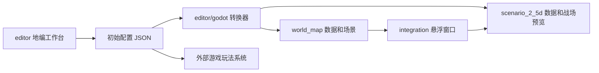

# 模块依赖与数据流

三个模块保留在同一仓库，共用 `project.godot`，不是三个互不关联的项目。

| 目录 | 责任 | 依赖 |
| --- | --- | --- |
| world_map | 连续移动、Hex 内容组织、导航、道路中心线、地点、迷雾、存档、交互 UI | Demo 经 integration 进入 2.5D；核心不承载战斗系统 |
| scenario_2_5d | 正交摄像机、纸绘视觉、3D 深度、遮挡淡化、交互和生命周期 | 核心可独立运行，不依赖大地图 |
| editor | 探索/战场布局、类型参数、逻辑范围、引用、验证、历史、预览、保存导出 | 浏览器部分使用原生 JS；Godot 转换依赖两个模块的数据类 |
| integration | 从大地图交互打开 SubViewport 悬浮场景，冻结地图并在结束后恢复 | 依赖大地图和 2.5D 公共信号 |
| tools | 引擎查找、包检查、白名单打包 | Node.js / PowerShell |

`editor/examples/` 保存地编源文件，`editor/exports/` 保存附带的可运行转换示例。WorldMapDefinition.editor_data 与 SceneDefinition.metadata.editor_data 携带完整新配置。正式伤害、减速、控制、自动部署、战斗和结算在外部系统实现；编辑器模拟不替代运行时。

业务条件/事件通过稳定 ID 关联。运行状态与源配置分离。暂停窗口使用原场景，关闭后恢复，而非重新加载世界。详细接口见 [悬浮场景接入](../integration/README.md)、[编辑器数据合同](../editor/docs/DATA_CONTRACT.md) 和各模块 docs。

上传包不包含旧下载压缩包、提示词草稿、引擎二进制、导出模板、编辑器主题或缓存。需求表保留在 editor 中作为实现依据；其中引用的外部策划资料不是运行依赖。
