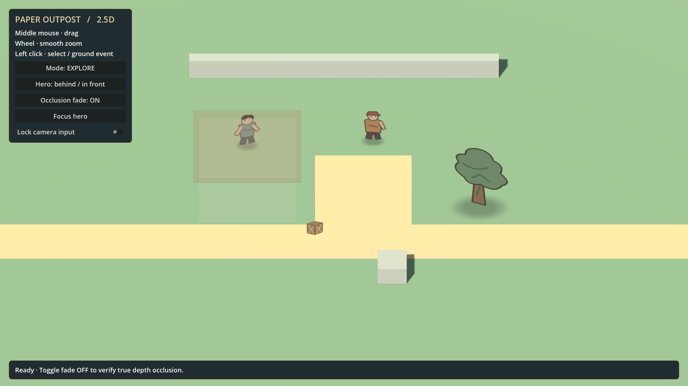

# 2.5D 场景地编使用手册

适用项目：`E:\gamejam`。适用引擎：Godot 4.7.2。更新日期：2026 年 10 月 7 日。

本手册用于制作基于当前 `scenario_2_5d` 框架的据点、战斗场地和探索空间。地编通过 Godot 的场景树、3D 视图和检查器完成摆放与配置，再运行场景确认纸绘立片、拾取和遮挡效果。

当前支持普通 3D 物件编辑和导出参数配置；立片、Blob Shadow、Demo UI 和摄像机姿态由运行时脚本生成或设置，尚无编辑器实时预览插件。因此，制作流程必须包含“保存并 F6 运行”的检查步骤。本手册不会将尚未实现的工具当作已有功能。

## 阅读顺序

首次使用依次完成“打开项目”“编辑器基础”“复制工作场景”“第一次摆放练习”。继续制作时按物件类型查阅后续章节。交付前使用“验收与交接清单”。

| 任务 | 查阅章节 |
| --- | --- |
| 开始制作新场景 | 复制工作场景与资源 |
| 摆建筑和地形 | 地面与道路、建筑与墙体 |
| 摆角色和树 | 纸绘立片、树木与装饰 |
| 添加箱子和 NPC | 可交互物件 |
| 配置建筑透明 | 遮挡淡化与目标 |
| 调整镜头活动范围 | 摄像机与边界 |
| 排查不显示或点不到 | 常见问题 |

## 一 打开项目和运行参考场景

1. 启动 Godot 4.7.2，在项目管理器选择“导入”。
2. 选择 `E:\gamejam\project.godot`，点击“导入并编辑”。项目已打开时不必再次导入。
3. 等待脚本和贴图导入结束。
4. 在左下方“文件系统”面板展开 `res://scenario_2_5d/demo/`。
5. 双击 `Scenario25DDemo.tscn`，切换到顶部的“3D”工作区。
6. 按 F6 运行当前场景；停止后返回编辑器。

F5 启动项目默认的世界地图；2.5D 场景使用 F6。两者目录独立，不需要修改 `project.godot` 的主场景。

项目内已提供 Godot 可执行文件：`.tools/godot/Godot_v4.7.2-stable_win64.exe`。也可从项目根目录的 PowerShell 执行以下命令：

```powershell
./scenario_2_5d/tools/Run-Demo.ps1 -Editor
```

这个脚本打开的是参考 Demo。制作自己的关卡时，在编辑器中打开自己的 `.tscn` 并按 F6。

运行时操作：

| 操作 | 结果 |
| --- | --- |
| 按住中键拖动 | 在 XZ 平面平移镜头 |
| 滚轮 | 平滑改变正交镜头的观察范围 |
| 左键点击箱子或 NPC | 选择物件并显示信息面板 |
| 信息面板 Interact | 发出交互请求，在 Demo 底栏显示 ID |
| 左键点击可拾取地面 | 显示世界坐标和地面标记 |
| Mode 按钮 | 切换探索和战斗的地面事件 |
| Fade 按钮 | 开关遮挡淡化 |
| Hero 前后按钮 | 将测试角色切换到 Demo 的两个固定坐标 |

本版点击地面不会移动角色，点击 Interact 不会真正开箱或开始对话。地编需要验收的是空间、画面和接口是否可用。

## 二 编辑器基础操作

编辑器主要使用三个区域：左侧场景树用于选择节点，中间 3D 视图用于摆放，右侧检查器用于精确填写参数。左下方文件系统显示项目资源。

| 常用操作 | 方法 |
| --- | --- |
| 移动物件 | 选中节点，使用移动工具，默认快捷键 W |
| 旋转物件 | 使用旋转工具，默认快捷键 E |
| 缩放视觉 Mesh | 使用缩放工具，默认快捷键 R |
| 找到选中的物件 | 在 3D 视图中按 F 聚焦 |
| 精确调整位置 | 检查器展开 Transform → Position |
| 网格对齐 | 开启工具栏吸附，使用 Snap Settings 设置步长 |
| 撤销操作 | Ctrl+Z |
| 保存场景 | Ctrl+S |

上述 3D 操作键为 Godot 默认配置；团队修改过快捷键时，以工具栏提示为准。编辑器视角允许绕场景观察，这不代表运行镜头可以旋转。参见 [Godot 4.7 的 3D 编辑器说明](https://docs.godotengine.org/en/4.7/tutorials/3d/introduction_to_3d.html)。

本项目的坐标约定：X 为左右方向，Z 为场地前后方向，Y 为高度。平面场地的地表在 Y=0。以下教程的坐标均以关卡根节点 Transform 为 Position=(0,0,0)、Rotation=(0,0,0)、Scale=(1,1,1) 为前提。Geometry、Actors、CameraPivot 等组织节点也保持默认 Transform，方便坐标和摄像机边界一致。

摆放建筑、角色、树或箱子时，通常选它的根节点。例如移动箱子选择 `Actors/Crate`，而不是只移动 `Actors/Crate/Billboard`，这样碰撞体、视觉和阴影会一起移动。对平面布局先调 X/Z，Y 只有在物件上高台或需要地表高度修正时才调整。

## 三 认识场景树

参考场景的关键结构如下。名称用来对应已有 Demo，不要求所有正式关卡沿用同一个根节点名。

```text
Scenario25DDemo
├─ CameraBounds                   手工镜头活动边界
├─ CameraRig                      镜头控制器
│  └─ CameraPivot
│     └─ Camera3D                 正交镜头
├─ InteractionController          鼠标拾取与选择
├─ OcclusionController            遮挡检测
├─ Lighting
│  ├─ Environment                 环境光
│  └─ Sun                         主光源
├─ Geometry
│  ├─ Ground                      地面与地面碰撞
│  ├─ Road                        道路视觉
│  ├─ Plaza                       广场视觉
│  ├─ Building                    建筑 Mesh 与碰撞
│  ├─ BackWall                    墙体
│  └─ Obstacle                    实体障碍
├─ Actors
│  ├─ Hero                        测试角色
│  ├─ NPC                         可交互 NPC
│  ├─ Crate                       可交互箱子
│  └─ Tree                        可淡化树木
├─ NavigationRoot                 后续导航接入位置
├─ SpawnRoot
│  └─ Arrival                     出生点标记
└─ DemoUI                         运行时测试面板
```

地编主要修改 Geometry、Actors、Lighting、CameraBounds、SpawnRoot 和各类 Definition 资源。复制场景时保留三个控制器与 CameraRig，避免破坏框架引用。

参考运行画面：



图中是运行后的效果。编辑器中目前不会显示脚本生成的角色纸片、树纸片和软阴影。

## 四 复制工作场景与资源

### 建立关卡目录

以下是制作新关卡的示例命名，目录和文件需由制作者创建，并非已经存在的模板：

```text
res://scenario_2_5d/levels/camp_01/
├─ Camp01.tscn
├─ data/
│  ├─ SceneDefinition.tres
│  └─ interactables/
│     ├─ SupplyCrate01.tres
│     └─ Keeper01.tres
└─ assets/
```

在 Godot 文件系统面板中新建目录。资源尽量通过 Godot 面板移动和重命名，便于更新引用。不要把关卡内容放进 `world_map/`。

### 另存工作场景

1. 打开参考 `Scenario25DDemo.tscn`。
2. 使用“场景 → 另存为”，保存为 `res://scenario_2_5d/levels/camp_01/Camp01.tscn`。
3. 确认当前场景标签已经是 Camp01。
4. 初次制作保留原 DemoUI 和 Hero，使用原测试面板检查功能。
5. 将关卡根节点及 Geometry、Actors 等组织节点保持在原点，Scale 保持 1。

另存 `.tscn` 只复制布局文件，**不会自动复制它引用的外部 `.tres` 和 PNG**。必须继续隔离需要单独修改的资源。

### 创建独立的场景定义

1. 选中关卡根节点。
2. 找到检查器中的 `Definition` 字段。
3. 打开该资源字段的菜单，选择“Make Unique／使唯一”。
4. 展开资源，使用资源菜单中的“Save As／另存为”，保存到新关卡的 `data/SceneDefinition.tres`。
5. 将 `scene_id` 改为示例 `camp_01`，`display_name` 改为关卡名字。
6. 确认字段现在引用新路径，保存场景。

检查器可能将脚本字段显示为 `Definition`、`Scene Id` 等带空格的名称。本文同时给出代码中的原字段名，便于搜索。

### 隔离需要独立修改的其他资源

每个箱子和 NPC 的静态定义也按“Make Unique → Save As → 修改 ID”处理。贴图允许共享。材质、Mesh 和 Collision Shape 只有在希望单独改变它们时才使唯一。

Godot Resource 默认可能共享。复制节点后修改资源内容可能影响其他实例；需要单独编辑时先 Make Unique。参见 [Godot 4.7 的场景实例与共享资源说明](https://docs.godotengine.org/en/4.7/getting_started/step_by_step/instancing.html)。

## 五 第一次摆放练习

在自己的工作场景中完成下面的小练习：

1. 选中 `Geometry/Building`，将 Position 改为 (-6,0,0)。建筑的根节点位于脚底，其子 Mesh 和 Collider 自己有高度偏移，根节点 Y 保持 0。
2. 选中 `Actors/Crate`，将 Position 改为 (-2,0,3)。
3. 选中 `Actors/Tree`，将 Position 改为 (6,0,1)。树在编辑器里暂时不可见，可通过场景树选中并填写坐标。
4. 保存并按 F6。
5. 检查物件布局；点击箱子，确认出现信息面板。
6. 停止运行，修改一个坐标，再次保存并 F6，确认改动生效。

不要在这次练习中使用 Hero 前后切换按钮验收新建筑位置。按钮仍将 Hero 放到 (-5,0,-3.2) 或 (-5,0,4)，不会根据新布局自动更新。新关卡遮挡测试按后文的方法在编辑器中摆放目标。

## 六 地面与道路编辑

### 修改现有地面

参考地面 `Geometry/Ground` 是 StaticBody3D，其下有 Mesh 与 Collider。根节点 Y=-0.25，厚度为 0.5，因此顶面正好在 Y=0。

只改视觉 Mesh 不会同步改碰撞。扩大关卡时，同时调整地面 Mesh、Collider 和摄像机边界。

示例：将地面改成宽 44、深 32、厚 0.5，维持顶面 Y=0：

| 节点或资源 | 设置 |
| --- | --- |
| Ground 根节点 Position | (0,-0.25,0) |
| Ground/Mesh 的 Mesh | 先 Make Unique，再将 BoxMesh.size 设为 (44,0.5,32) |
| Ground/Mesh 的 Transform Scale | (1,1,1) |
| Ground/Collider 的 Shape | 先 Make Unique，再将 BoxShape3D.size 设为 (44,0.5,32) |
| Ground/Collider 的 Transform Scale | (1,1,1) |
| CameraBounds.bounds | Position=(-22,-16)，Size=(44,32) |

参考 Demo 用同一个单位 Cube 和 Box 资源，加子节点 Scale 来获得尺寸。若直接改变共享 Cube.size 或 Box.size，其他建筑、道路和障碍也可能一起改变。上述操作先使唯一，再把原有 Scale 重置为 1，以免尺寸重复放大。

### 添加地面模块

可以创建多个地面块，不必强制使用网格系统：

1. 在 Geometry 下添加 StaticBody3D。
2. 添加 MeshInstance3D 子节点，设置 Mesh 与材质。
3. 添加 CollisionShape3D 子节点，配置匹配的 Shape。
4. 将该 StaticBody3D 加入 `scenario_ground` Group：选中节点，打开右侧 Node／节点面板的 Groups／分组，添加名称并勾选。
5. 在 Collision Layer 中勾选第 1 层。
6. 确保各地面顶面连续，保存并运行点击接缝附近测试。

`scenario_ground` 加在实际被射线命中的 Body 上，而不是 Geometry 容器或单纯 Mesh 上。否则画面虽像地面，点击也不会发出地面事件。

### 编辑道路与广场

参考 Road 和 Plaza 是视觉 Mesh，没有独立 Collider，地面点击命中下方 Ground。它们略高于地面以避免重叠闪烁。

可移动、复制、旋转这些 Mesh 组成路径，调整颜色或材质。只改颜色时先对材质 Make Unique，除非希望所有引用该材质的道路一起变化。

如果新道路、高台或斜坡需要返回自身真实表面高度，必须增加匹配的 Body/Collider，并将 Body 加入 `scenario_ground`。否则射线仍命中下方平地。该 Group 仅表示地面事件接收对象，不会自动使场地可行走或生成导航。

## 七 建筑墙体与障碍编辑

### 移动和复制建筑

1. 选中 `Geometry/Building` 根节点。
2. 移动整个根节点；需要朝向变化时调整根节点的 Y 轴旋转。
3. 复制完整根节点及其子节点，重命名为 `Building02` 等清楚的名字。
4. 保持根节点 Scale=(1,1,1)。改变尺寸时分别调整视觉与 Shape，而非直接缩放物理根节点。
5. F6 验证建筑是否挡住隐藏角色，以及是否挡住后面的鼠标拾取。

### 修改建筑尺寸

建筑由 Walls、Roof 和 Collider 组成。改变建筑尺寸时三者都需调整。例如做宽 6、墙高 4、深 5 的建筑：

| 子节点 | Position | 尺寸 |
| --- | --- | --- |
| Walls | (0,2,0) | BoxMesh.size=(6,4,5) |
| Roof | (0,4.2,0) | BoxMesh.size=(6.6,0.4,5.6) |
| Collider | (0,2.2,0) | BoxShape3D.size=(6.6,4.4,5.6) |

这是一个简化整栋建筑的包围体示例。每个被修改的 Mesh/Shape 先 Make Unique，各子节点 Scale 重置为 1。若玩家需要从门洞通过，整块 Box Collider 无法表达门洞；应由程序或物理负责人协助拆分碰撞。

### 使用外部 3D 模型

将项目可导入的模型资源放入关卡 assets 目录，再从文件系统拖入建筑根节点下。用导入模型替换原 Walls/Roof 时，保留外部 StaticBody3D 和实际 Collider，检查模型脚底、尺寸及朝向。

导入模型不保证自动具有合适的碰撞或可淡化材质。先用简化 BoxShape 做阻挡测试；若使用自定义 Shader，按“遮挡淡化”章节确认支持情况。需要精确复杂碰撞时交给物理负责人处理。

### 普通障碍

普通障碍使用 StaticBody3D + Mesh + Collider，Collision Layer 勾选第 1 层。没有挂 Occluder 脚本时不会自动淡化，这是正常行为。不要把障碍加进 `scenario_ground`，否则点击它会当作地面点击。

碰撞形状建议用独立资源的尺寸表达大小，避免非均匀缩放物理节点。关于形状选择与缩放限制，参见 [Godot 4.7 的 3D 碰撞形状说明](https://docs.godotengine.org/en/4.7/tutorials/physics/collision_shapes_3d.html)。

## 八 纸绘立片与阴影编辑

### 当前的预览方式

角色、NPC、树和箱子的 QuadMesh 在运行时创建。编辑器中选中 Billboard 能修改字段，但不会直接出现对应纸片。复制或移动时通过父节点、碰撞轮廓与检查器坐标确定位置，保存后 F6 查看结果。

不要因为编辑器里看不到立片而重新添加 Sprite2D，或删除 Billboard 脚本。当前 DemoUI 和 BlobShadow 同样需要运行后查看。参数在运行中没有统一实时重建逻辑，调参后应停止并重新运行。

### 常用参数

选择物件下面的 Billboard 节点：

| 字段 | 用途 | 使用方法 |
| --- | --- | --- |
| texture | PNG 贴图 | 从文件系统拖入字段 |
| visual_height | 整个立片矩形的高度 | Hero/NPC 示例 2.6，箱子 1.5，树 5.0 |
| visual_scale | 宽高倍率 Vector2 | 默认 (1,1)，需要单独改宽度时调 X |
| ground_offset | 整张立片的垂直偏移 | 正值上移，负值下移 |
| pivot_offset | 立片局部水平与垂直微调 | 通常保持 (0,0) |
| linear_filter | 线性过滤 | 纸绘素材保持 true，像素素材才按需要关闭 |

默认立片宽度根据图片宽高比与 visual_height 计算。visual_scale 再对宽、高分别乘倍率。立片只绕世界 Y 轴朝向摄像机，保持竖直，手工旋转 Billboard 会在运行时被脚本覆盖。

优先改 visual_height 和 visual_scale，保持 Actor 根节点和 VisualRoot 的 Scale 为 1。这样 Collider、阴影和目标点不会意外被一起缩放。

### 解决脚底漂浮

底部锚点对齐的是图片矩形底边。PNG 底部若有透明留白，角色实际脚底仍会悬空。

先修剪图片底部多余透明区域；无法修改素材时再用 ground_offset 负值补偿。例如整张图片底部透明留白占高度的 10%，visual_height=2.6、visual_scale.y=1，可先尝试 ground_offset=-0.26，再运行微调。

pivot_offset.y 也会移动立片，但与 ground_offset 叠加。落地修正尽量集中在一个字段中，便于后续维护。不要直接修改运行时生成的 PaperQuad，改动不会作为场景制作参数保存。

### 编辑 Blob Shadow

选择物件的 BlobShadow 节点：

| 参数 | 含义 |
| --- | --- |
| shadow_size | 阴影平面宽与深，例如角色 (1.5,0.9) |
| opacity | 透明度，0 为不可见，1 为全不透明，默认 0.28 |

阴影的位置和旋转在运行时设置：局部高度约 0.025，贴在水平面上。不要通过修改该节点 Transform 来期望改变运行时落地高度。将整个 Actor 放到高台高度，可以一起抬高视觉和阴影；坡地阴影法线和射线贴地尚未实现，需要程序适配。

## 九 树木与装饰摆放

复制 `Actors/Tree` 可以得到具有 Collider 和淡化功能的树。编辑根节点 Position、Billboard.texture、visual_height、BlobShadow.shadow_size，并根据新树冠尺寸调整 Collider。

树的视觉会朝向摄像机，但其固定 Collider 不会随 Billboard 自动旋转。当前固定镜头下可用简化包围体表达树冠，避免明显过大的碰撞导致鼠标在透明区域也被挡住。

仅作装饰的纸绘对象可以用 Node3D + Billboard + 可选 BlobShadow，不添加 Collider 就不会拦截拾取，也不会参与 Occlusion ray 检测。希望遮挡目标时淡化的树或大装饰必须具有 Occluder 脚本及第 2 碰撞层。

同类装饰可以共享贴图和视觉材质，不必为每棵树复制 PNG。所有对象都会真实参与深度关系；不应使用“永远置顶”的视觉效果绕过建筑遮挡。

## 十 可交互箱子与 NPC

### 复制可交互物件

以新增补给箱为例：

1. 复制完整的 `Actors/Crate`，重命名为 `SupplyCrate02`。
2. 移动根节点到所需位置，Scale 保持 1。
3. 在根节点检查器中，对 `Definition` 执行 Make Unique。
4. 将定义另存到关卡 `data/interactables/SupplyCrate02.tres`。
5. 设置独立 object_id，例如 `camp_01_supply_crate_02`。
6. 修改名字、类型和说明。
7. 检查根节点 `Visual` 字段指向复制后的 Billboard，而不是原箱子的 Billboard。必要时从场景树将正确节点拖入字段。
8. 调整 Billboard 和 Collider，保存并运行测试。

NPC 的操作相同，复制 `Actors/NPC` 即可。根节点应继续挂 `interactables/interactable_3d.gd`，实际类型为 StaticBody3D。

### Definition 填写规范

| 字段 | 地编填写内容 |
| --- | --- |
| object_id | 稳定且唯一的身份，例如 camp_01_keeper_01 |
| display_name | 玩家或测试面板看到的名字 |
| interaction_type | 与玩法负责人约定的类型，例如 inspect、talk |
| description | 面板说明或占位文案 |
| icon | 可选图标；当前 Demo 信息面板不显示它 |
| tags | 可选分类标签，需与程序约定 |
| metadata | 约定的扩展数据，没有约定时留空 |

节点名字与 object_id 是不同概念。给节点改名不会自动更新 object_id；复制节点也不会自动产生新 ID。物件只是换位置时保留原 ID；新增独立物件时使用新 ID。

interaction_type 只是数据。填写 talk 不会自动生成对话，填写 loot 不会自动生成背包内容。地编负责提供正确内容，行为由玩法系统接入。

### RuntimeState

RuntimeState 是运行中的状态。未配置时框架自动创建，配置资源时会在运行后为每个实例深拷贝。enabled 控制是否允许交互；selected 在初始化时会重置；custom_state 留给外部系统。

正常可交互物件保持 enabled=true。禁用交互后它的 Collider 仍会挡住后方物件和地面，并不会自动允许点击穿透。

### 检查拾取范围

选择 Collider，使用适合物件的独立 BoxShape3D 等形状，适度覆盖可点击区域。小箱子不应使用整棵树大小的 Collider。

拾取使用 Collider，而非 PNG 非透明像素。点击透明边缘仍可能命中形状，这是当前实现的正常限制。必须用 F6 检查视觉与拾取范围是否一致。

可交互物件仅有普通 3D Mesh、未设置 Visual 时仍可发事件，但默认纸绘高亮没有效果；正式 Mesh 高亮需要程序接入。

## 十一 遮挡淡化与目标配置

遮挡物和目标分属两个角色：遮挡物是挡住视线的建筑或树；目标是被保护的角色或重要物件。仅放一个建筑或勾选第 2 层不会自动完成全部配置。

### 配置遮挡物

沿用参考 Building 或 Tree 是最简单的方法。新建遮挡物需要：

1. 使用 StaticBody3D 作为根节点。
2. 挂脚本 `res://scenario_2_5d/occlusion/occluder_3d.gd`。
3. 添加实际 Mesh 和 CollisionShape3D。
4. Collision Layer 勾选第 1 层与第 2 层。
5. 设置可支持淡化的材质。

这里勾选“第 1 和第 2 个复选框”，不是只勾“第 3 个”。两层同时启用的数值是 3。Interaction 的查询使用第 1 层，Occlusion 的查询使用第 2 层。

| 对象 | Collision Layer | Group 或脚本 |
| --- | --- | --- |
| 地面 | 第 1 层 | Body 加 scenario_ground |
| 普通障碍 | 第 1 层 | 无需 Occluder 脚本 |
| 可交互箱子或 NPC | 第 1 层 | Interactable 脚本 |
| 可淡化建筑或树 | 第 1 层 + 第 2 层 | Occluder 脚本 |
| 纯视觉装饰 | 无物理 Body 时不设置 | 不参与物理查询 |
| OcclusionTarget | Marker3D，无 Layer | OcclusionTarget 脚本 |

不要通过修改 Controller 的 pick_mask 或 occluder_mask 适配某一件物件，优先修正物件的 Collision Layer。Collision Mask 与 Layer 是不同字段；当前射线能否命中主要由物件所在 Layer 和控制器查询层决定。

当前支持 StandardMaterial3D 和框架默认纸绘 Shader。其他自定义 Shader 可能不会淡化；完全没有受支持材质时会输出警告。linear_filter=false 会使用另一份纸绘 Shader，当前 Occluder 自动识别只针对默认 Shader，像素风遮挡物需程序确认适配。

单个节点只能挂一份脚本。不要给箱子挂 Occluder 脚本来覆盖原 Interactable 脚本。如果需要“同一个物件既可交互又能淡化”，交给程序制作组合组件；简单叠加两个 Body 可能导致其中一个 Collider 挡住自己的拾取。

### 配置保护目标

参考 Hero 已有 `Actors/Hero/OcclusionTarget`，局部位置为 (0,1.1,0)。新增一个需要保护的角色时：

1. 在角色根节点下添加 Marker3D，命名 OcclusionTarget。
2. 挂 `res://scenario_2_5d/occlusion/occlusion_target.gd`。
3. 将 Marker 放在角色胸口或需要保护的可见中心。
4. 保存并运行。初始场景中的目标会自动被框架收集。

仅改节点名为 OcclusionTarget 不足以注册，需挂该脚本。运行中动态生成的目标由程序显式注册。被选中的 Interactable 会自动创建高度 0.7 的目标点；高大或异形物件需要程序提供更合适的目标点。

### 验收淡化

对新布局，将 Hero 根节点直接摆到建筑后方并 F6；不要依赖 Demo 固定坐标按钮。观察建筑是否淡化，然后停止运行，把 Hero 放到前方再运行，确认建筑恢复。

在原始 Demo 可以使用 Fade OFF 和 Hero 前后按钮检查真实深度：后方角色完全被建筑挡住，前方角色可见。Fade ON 后保护目标被挡时建筑降透明度。遮挡解除后需要稍等平滑恢复。

Occlusion 根据 Collider 判定，并使用平行正交射线。树冠透明空隙、宽包围体或屋顶形状不一致都可能使淡化范围大于实际画面遮挡，优先检查碰撞体。

## 十二 摄像机与边界配置

### 设置摄像机参数

选中关卡根节点，展开独立的 Definition：

| 字段 | 默认值 | 作用 |
| --- | --- | --- |
| default_camera_size | 20 | 初始正交观察范围；数值大，看到范围大 |
| min_camera_size | 10 | 最近观察范围 |
| max_camera_size | 26 | 最远观察范围 |
| zoom_step | 1.5 | 每格滚轮改变的目标 size |
| camera_drag_smoothing | 20 | 拖动追上目标的速度 |
| camera_zoom_smoothing | 12 | 缩放追上目标的速度 |
| camera_margin | 2 | 允许边界附近少量露出的余量 |
| default_scene_mode | EXPLORE | 默认地面事件模式 |

size 必须大于 0，并满足 min <= default <= max；平滑速度使用正值。调整 size 无需移动 Camera3D 来模拟缩放。

选中 CameraRig 可配置 yaw_degrees、pitch_degrees、distance。团队尚未确定新视角时保持 0、-50、30。玩家输入不会改变这些角度；地编改变它们会改变整体遮挡、阴影和可见范围，应重新验收。

不要直接修改 Camera3D 的 Rotation/Position 来设置最终视角，这些字段会在运行时被 CameraRig 覆盖。也不要旋转或缩放 CameraRig/CameraPivot 来“修正”镜头。

### 设置边界

Demo 的 CameraRig.bounds_node 引用了 CameraBounds，因此 **CameraBounds.bounds 优先于 Definition.camera_bounds**。仅改 Resource 中的 camera_bounds 不会覆盖已经绑定的 Bounds 节点。

选中 CameraBounds，在 bounds 的 Rect2 中填写：

| Rect2 项 | 世界含义 | Demo 值 |
| --- | --- | --- |
| Position.x | 最小 X | -18 |
| Position.y | 最小 Z | -14 |
| Size.x | X 方向宽度 | 36 |
| Size.y | Z 方向深度 | 28 |

最大 X=Position.x+Size.x，最大 Z=Position.y+Size.y。Rect2 的 y 在这里表示 Z，不是场景高度。CameraBounds 节点目前没有边界线 Gizmo，移动它的 Transform 也不会平移这些数值，应直接改 bounds。

建议同时将 Definition.camera_bounds 填为同样值，避免以后移除 bounds_node 引用时回退到错误范围。

初始镜头中心由 CameraRig 的 X/Z Position 决定。需要从另一片区域开场时调整该节点 Position，Y 保持 0；位置仍会受边界约束。

### 检查边缘露空

场地要容得下最大缩放时的完整视野。控制器已经计算可见范围；当某个方向的地面比视野还小，该轴会居中，但不能消除场地外的空白。

在最大 size 下拖到四个方向检查边缘。出现大量空白时，扩大真实地面、降低 max_camera_size，或减小 camera_margin；只扩大 CameraBounds 不会自动生成地面。

## 十三 光照贴图与材质

### 固定光照

场景已有 `Lighting/Sun` 和 `Lighting/Environment`。Sun 控制光线方向、颜色、能量和真实建筑阴影；Environment 控制环境光与背景。

先保留参考参数完成布局，之后再调整风格。改光照时分别检查建筑层次、纸绘原色和阴影是否清楚。纸绘 Shader 保留部分原色，其受光变化小于普通 3D Mesh，这是当前设计。

编辑器预览光照与运行画面可能有差别，最终以 F6 的实际画面为准。不需要为每个角色额外添加光源。

### 替换 PNG

1. 将带透明背景的 PNG 放到关卡 assets 目录。
2. 等待 Godot 导入。
3. 选择 PNG，在 Import／导入面板检查 `Mipmaps → Generate` 与 `Process → Fix Alpha Border`，启用后点击 Reimport／重新导入。
4. 将 PNG 拖到目标 Billboard.texture。
5. 按素材比例修改 visual_height，调整脚底留白和 Collider。
6. 保存并重新运行，在最小与最大缩放下检查边缘、清晰度和落地。

普通新 PNG 的导入参数不一定和参考 PNG 相同，需要检查。不要运行 `debug/generate_placeholders.gd` 来替换正式美术，它会重写参考 Demo 的四张占位 PNG。

## 十四 出生点导航与高低差

### 出生点

复制 SpawnRoot/Arrival 或新增 Marker3D，挂 `spawn/spawn_point_3d.gd`。设置稳定 spawn_id，例如 `camp_01_arrival`；不同出生点使用不同 ID。Position/Rotation 是后续生成单位时读取的空间标记，metadata 按团队约定填写。

当前不会根据 SpawnPoint 自动生成或移动 Hero。验收时应分别检查预摆测试角色与出生点，不能把二者当作已经自动绑定。

### 导航

保留 NavigationRoot，向导航负责人提供通道宽度、障碍范围、高台连接与出生点。当前没有导航区域、烘焙、寻路和单位移动，单纯添加 NavigationRoot 或地面 Group 不会产生这些能力。

### 高台与坡地

框架使用真实 Y 高度，可以摆高台 Mesh 和对应 Collider，并把 Actor 根节点放到台面高度。例如台面 Y=2 时，站在台面的 Actor 根节点可设 Y=2。

当前拾取只保证基本平面场景，复杂上下层优先级、坡地角色移动、阴影法线适配需程序参与。首次交付优先使用平坦场地；需要真实高低差时同时提供碰撞与玩法接入说明。

## 十五 整理组件与制作正式场景

当前没有专门的物件库面板。重复使用建筑、树或箱子时，可在 Godot 中把完整节点分支另存为独立场景，再将 `.tscn` 拖入关卡。这是 Godot 原生的场景实例工作流，并非项目已提供的组件库。

保存分支前确认脚底原点、Scale、Collider、脚本与资源引用完整。可交互组件的默认 object_id 不能直接给所有实例共用；每个正式实例要绑定独立 Definition。修改组件源场景会影响引用它的关卡，只有公共改动才在源场景中进行。

制作初期保留 DemoUI 有利于检查选择和地面事件。交付正式玩法前，由程序或关卡技术负责人处理：

1. 删除 DemoUI，或替换成正式 UI。
2. 将根脚本从 `demo/scenario_demo.gd` 换成 `core/scenario_controller.gd`，或正式项目的适配脚本。
3. 检查 Definition、Camera Controller、Interaction Controller、Occlusion Controller 四个导出引用仍然有效。
4. 确认正式宿主负责窗口设置；移除 Demo 脚本后不再临时设置 1920×1080 content scale。
5. 决定测试 Hero/NPC 是否替换为正式生成对象；保留必要的 OcclusionTarget。
6. 接入实际交互、模式与场景退出逻辑。

不必为了交付布局而让地编自行改框架代码。缺少正式玩法适配时，在交接说明中标注“工作场景，保留 DemoUI”，仍可交付布局和资源。

## 十六 每轮编辑后的验收

每轮更改后保存并重新 F6。一次集中修改一类内容，便于确定问题来源。

| 检查项目 | 合格现象 |
| --- | --- |
| 地面 | 视觉连续，点击能返回正确位置，无明显重叠闪烁 |
| 物件落地 | 脚底贴合地面，阴影靠近脚底，无明显穿插 |
| 碰撞 | 与视觉范围匹配，建筑不会允许点到背后对象 |
| Interactable | Hover、Selected、名字、类型、说明、ID 都正确 |
| 交互按钮 | Interact 发出当前物件 ID，不触发地面事件 |
| 镜头 | 中键平移，滚轮缩放，右键不旋转，松手停止 |
| 边界 | 最大缩放时四个方向的露空处于可接受范围 |
| 深度 | 角色在建筑后被挡，站到前面可见 |
| 淡化 | 保护目标被挡时淡化，移开或取消目标后恢复 |
| 窗口 | 大窗口和较小窗口中 UI、拾取和拖动正常 |
| 模式 | 探索与战斗的地面事件名称分别正确 |
| 调试输出 | 没有新增脚本报错或缺失资源警告 |

可从项目根目录运行框架回归：

```powershell
./scenario_2_5d/tools/Run-Tests.ps1 -Render
```

该脚本验证的是参考 Demo 和框架，**不会自动遍历并验收新制作的 Camp01 等关卡**。新关卡仍要完成本表检查。自动测试逐项结果见 `../debug/test_results.json` 与 `../debug/render_test_results.json`，既有验收说明见 [框架测试清单](SCENARIO_25D_TEST_CHECKLIST.md)。

## 十七 常见问题

| 现象 | 优先检查 | 处理 |
| --- | --- | --- |
| 编辑器里看不到角色或树 | Billboard 是运行时生成 | 从场景树选中，填坐标，保存后 F6 |
| F6 后仍没有纸片 | texture、visual_height、位置、视野 | 绑定有效 PNG，检查是否被建筑挡住或在镜头外 |
| 看不到软阴影 | BlobShadow 节点、opacity、Actor 高度 | 确认阴影在当前实际地面附近；坡地联系程序 |
| 改了贴图或高度未生效 | 是否仍是上一次运行 | 停止，保存，再次 F6 |
| 角色脚底悬空 | 图片底部透明留白 | 修剪 PNG，或按比例用负 ground_offset 修正 |
| 点箱子没有反应 | Definition、enabled、Collider、第 1 层 | 逐项补齐，确认前方没有其他 Collider 挡住 |
| 点透明区域也被挡 | 拾取使用物理 Shape | 调小或重新制作 Collider |
| 点击地面不显示坐标 | 实际命中 Body 的 Group | 给该 Body 添加 scenario_ground，并启用第 1 层 |
| 建筑变大但阻挡范围不变 | 只改了 Mesh | 同步调整独立 Collider Shape |
| 修改一个形状导致很多物件变化 | Mesh/Shape/Material 共享 | 撤销，先 Make Unique，再修改 |
| 修改场景配置影响参考 Demo | 外部 Definition 仍共用 | 撤销共享改动，新关卡 Definition 另存新路径 |
| 建筑一直不淡化 | Occluder 脚本、第 2 层、目标与材质 | 目标放可见中心，修正层与支持的材质 |
| 建筑不挡画面却淡化 | Collider 比真实建筑大 | 调整包围体，检查屋顶与目标点高度 |
| 改 Resource 边界没变化 | CameraRig 绑定 CameraBounds | 修改 CameraBounds.bounds，并同步资源备用值 |
| 镜头无法沿某个方向拖动 | 当前视野比该方向场地更大 | 降低 size 或扩大真实地面与 bounds |
| 镜头边缘露出大片空白 | 最大 size、地面范围与 margin | 扩地面、降 max 或减 margin |
| Hero 按钮把角色移到错误位置 | Demo 使用固定测试坐标 | 新关卡在编辑器摆角色，不用这个按钮 |
| Camera 编辑器预览与 F6 不同 | 姿态由 CameraRig 设置 | 改 Rig 的导出参数，最终用 F6 验收 |
| F5 出现世界地图 | 项目默认主场景仍是世界地图 | 打开自己的关卡并用 F6 |
| 出生点没有生成角色 | 目前仅为空间接口 | 交由生成系统接入，地编提供 ID 与位置 |
| Interact 只显示文字 | 本版只发请求 | 这是框架行为，联系玩法负责人接开箱/对话 |

## 十八 交付与多人协作

交付自己的 `.tscn`、独立的场景和交互 `.tres`、新增贴图/模型/材质，以及资源对应的 UID 和导入描述文件。通过版本控制管理时遵循仓库现有忽略规则，不提交 `.godot` 缓存或 `.tools` 下生成的临时日志。

交付前重新打开自己的场景并 F6，确认没有缺失资源。提供至少一张总体布局运行截图、一张交互物件截图，以及需要特别验收的遮挡位置截图。

交接记录可使用以下格式：

```text
关卡名称：
场景路径：res://scenario_2_5d/levels/.../*.tscn
scene_id：
场景定义路径：
用途：探索 / 战斗 / 混合空间
地面范围：X min/max，Z min/max
摄像机：默认/min/max size，CameraBounds，margin
交互物件：object_id 列表，definition 路径，interaction_type
出生点：spawn_id 列表与用途
遮挡保护：目标位置与主要 Occluder
高低差：高度、Collider 和待接入内容
DemoUI：保留 / 已由程序替换
验收：本手册第十六章检查结果
待程序处理：导航、生成、交互或特殊材质等
资源作者与使用约定：
```

每个地编尽量负责独立关卡文件，避免多人同时修改同一个 `.tscn`。同一关卡需要合作时提前分工，复用部件另存成独立场景。移动公共资源、修改公共材质和组件源场景前先与引用它们的关卡负责人同步。

## 十九 技术负责人参考

当前编辑支持来自 Godot 原生 3D 编辑器和导出字段。没有 @tool 立片预览、自动碰撞适配、摄像机边界 Gizmo、对象 ID 自动生成、组件库面板或逐关卡验收器。发现需求时记录并交给程序，避免地编以为某个工具只是没有打开。

框架说明与详细接口：

- [模块使用与接入说明](../README.md)
- [模块架构](SCENARIO_25D_ARCHITECTURE.md)
- [实现报告](SCENARIO_25D_IMPLEMENTATION_REPORT.md)
- [框架验收清单](SCENARIO_25D_TEST_CHECKLIST.md)

本手册描述现有框架。后续编辑器工具完成后，应更新预览方式、组件库操作与验收流程，再统一培训地编人员。
