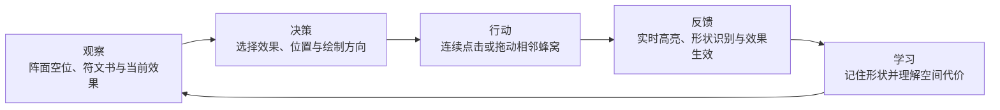

# 六相召唤阵玩法策划案

> 文档状态：网页验证版 v0.1  
> 验证范围：蜂窝绘制、符文识别、占用冲突、效果启停与本机存档

## 1. 玩法概述

玩家在圆形召唤阵内，以六边形蜂窝为最小单位连续绘制符文，也可以从奇物匣拖入已经成型的独特组块。系统根据经过蜂窝的相对形状识别符文，并将其转化为召唤效果。符文与奇物可以在同一阵面交错排布，但不能共用同一个蜂窝。玩家需要在有限空间内组合、启停和调整模块，构筑当前召唤方案。

### 核心体验锚点

**像真正的术士一样，在有限阵面中辨形、落笔与编排，让亲手绘制的几何结构转化为可组合的魔法效果。**

### 当前原型目标

- 验证六边形连续描画是否直观。
- 验证“形状识别而非固定位置识别”是否容易理解。
- 验证有限蜂窝占用能否产生有意义的排布决策。
- 验证符文书能否承担教学和查询功能。
- 验证启停符文是否适合作为召唤配置的一部分。

## 2. 挑战模型

### 阻力来源

| 阻力 | 当前表现 | 设计作用 |
| --- | --- | --- |
| 操作精度 | 必须连续经过相邻蜂窝，不能跳格或重复经过 | 形成“亲手画符”的仪式感 |
| 资源短缺 | 阵面只有 61 个蜂窝，已刻入符文会持续占格 | 迫使玩家规划位置与组合顺序 |
| 信息不完备 | 玩家需要阅读或记忆符文书中的形状与效果 | 形成学习、记忆和熟练度成长 |
| 计算复杂度 | 多个符文的形状、占位和效果需要共同权衡 | 支撑中后期构筑深度 |

当前验证版不加入时间压力。若后续用于战斗内施法，可将限时描画作为独立模式验证，避免过早混淆空间规划与反应操作。

### 核心动词

**观察 → 规划 → 描画 → 组合 → 启停。**

## 3. 体验循环

### 五个环节

1. **观察**：查看剩余蜂窝、已占用区域、顶部生效符文和右侧符文书。
2. **决策**：选择想获得的效果，判断形状能否放入阵面，并决定起点、方向、旋转或镜像方式。
3. **行动**：按住拖动或逐格点击相邻蜂窝；必要时撤回一格或取消笔画。
4. **反馈**：草稿以金色显示；匹配成功时即时显示符文名称；确认后使用该符文专属颜色并加入生效列表。
5. **学习**：玩家通过失败提示、图鉴对照和空间占用结果，逐渐记住符文并优化布局。

## 4. 核心规则

### 4.1 阵面

- 阵面以圆形为视觉边界。
- 内部使用半径为 4 的轴向六边形网格，共 61 个蜂窝。
- 蜂窝拥有“空闲、草稿占用、已刻入、已停用”四种视觉状态。
- 阵面空间是本玩法的主要资源。

### 4.2 绘制

- 玩家只能从空闲蜂窝起笔。
- 后续每一步必须进入与上一格相邻的蜂窝。
- 同一笔画中不能重复经过同一蜂窝。
- 可以按住拖动连续描画，也可以逐格点击。
- 点击非相邻空格时，系统开始一条新的草稿，避免玩家被错误笔画锁死。
- `Backspace` 撤回一格，`Esc` 取消当前笔画，`Enter` 尝试刻入。

#### 模拟绘画模式

- 工具栏提供“模拟绘画”开关，默认关闭，不影响原有精准蜂窝输入。
- 开启后，按住期间显示带轻微位置抖动与光晕的实时自由笔触，不立即修改规则层草稿。
- 松手时才对完整轨迹采样，将轨迹吸附为连续蜂窝路径，并进入正常识别流程。
- 当指针移动过快、单帧跨过多个蜂窝时，系统自动补齐直线经过的中间蜂窝。
- 笔触碰到已占用蜂窝时变为红色，并在冲突位置截断结算路径。
- 结算失败不会清除路径；玩家仍可撤回、取消或切回精准模式进行修正。

### 4.3 识别

- 识别依据是蜂窝路径的相对坐标与经过顺序，不依赖阵面绝对位置。
- 同一符文允许平移、六方向旋转和镜像。
- 正向与反向笔顺均视为同一符文。
- 识别成功后显示“已识别 · 符文名”，但只有点击“刻入符文”后才正式占用蜂窝并生效。
- 识别失败时保留草稿，允许玩家撤回修正，不强制清除。

### 4.4 多符文组合

- 不同符文可以相邻、包围或交错排布。
- 不同符文不能共用同一蜂窝。
- 已停用符文仍然占用原有蜂窝；停用表示关闭效果，不等于从阵面移除。
- 只有主动移除符文后，其蜂窝才恢复为空闲状态。

### 4.5 生效与存档

- 顶部列表显示阵面中全部已刻入符文及启停状态。
- 玩家可以独立勾选或取消勾选每一个符文。
- 同类符文暂时允许重复刻入；叠加规则由后续数值设计决定。
- “保存魔法阵”将阵面布局、符文类型和启停状态保存到本机。
- 再次打开时自动载入最近一次手动保存的版本。

### 4.6 奇物组块

- 奇物是已经成型的多蜂窝组块，不需要玩家逐格描画或等待识别。
- 玩家从左侧奇物匣拖动整件奇物，以落点蜂窝作为锚点放入阵面。
- 拖动过程中显示整个组块的落位预览：青色表示可放置，红色表示越界或发生占用冲突。
- 每种奇物全局唯一，同一阵面不能存在第二件同名奇物。
- 阵面可以同时放置多个不同奇物。
- 奇物一旦放入便立即生效，并与符文、其他奇物共用蜂窝占用规则。
- 奇物不能被停用；玩家可以将其回收到奇物匣，从而释放全部占用蜂窝。
- 存档需要记录奇物 ID、组块所占蜂窝和当前落位。

#### 当前奇物库

| 奇物 | 格数 | 效果 | 空间特征 |
| --- | ---: | --- | --- |
| 潮汐泵 Tide Pump | 3 | 每刻入一枚符文，恢复 3% 生命 | 紧凑三角组块 |
| 棱镜心脏 Prism Heart | 4 | 相邻符文效果强度提高 12% | 横向扩展、强调邻接 |
| 骨骰 Bone Die | 2 | 召唤完成时随机强化一种属性 | 低占位、容易填补缝隙 |

## 5. 当前符文库

| 符文 | 格数 | 当前效果 | 设计定位 |
| --- | ---: | --- | --- |
| 余烬 Ember | 4 | 召唤物攻击附加灼烧 | 低占位、基础进攻 |
| 回潮 Tide | 5 | 施法时恢复少量生命 | 生存与续航 |
| 壁垒 Ward | 6 | 生成一层短暂护盾 | 高占位、防御收益 |
| 疾风 Gale | 5 | 提升召唤物行动速度 | 节奏与机动强化 |
| 天钉 Sky Nail | 7 | 首次攻击获得贯穿效果 | 长距离、进攻与占位切割 |
| 回环 Cycle | 6 | 缩短召唤技能冷却时间 | 空心结构、循环强化 |
| 双峰 Twin Peak | 9 | 强化两个相邻符文的效果 | 高成本、布局联动核心 |

具体数值目前仅作界面语义占位。进入战斗验证前，应单独建立效果叠加、持续时间、触发时机和强度预算表。

## 6. 执行细则

### 6.1 原子操作

| 操作 | 触发方式 | 前置条件 | 结果 |
| --- | --- | --- | --- |
| 起笔 | 点击或按下空闲蜂窝 | 当前格未被其他符文占用 | 建立包含首格的草稿 |
| 模拟落笔 | 模拟绘画开启时按住空闲蜂窝 | 当前未在拖动奇物，首格空闲 | 实时显示抖动笔触但暂不识别 |
| 结算笔触 | 模拟绘画状态下松手 | 存在有效轨迹 | 采样并补齐路径、吸附到蜂窝、执行形状识别 |
| 延伸笔画 | 拖入或点击下一蜂窝 | 与末格相邻、空闲且未在本笔画中使用 | 将该格加入草稿 |
| 撤回一格 | 点击按钮或按 `Backspace` | 草稿不为空 | 删除草稿末格 |
| 取消笔画 | 点击按钮或按 `Esc` | 草稿不为空 | 清空草稿，不影响已刻入符文 |
| 刻入符文 | 点击按钮或按 `Enter` | 草稿匹配某个符文 | 生成符文对象、占用蜂窝并默认启用 |
| 启停符文 | 点击顶部复选框或阵面上的已占用蜂窝 | 目标符文存在 | 切换效果状态，保留占位 |
| 移除符文 | 点击顶部符文条目的删除按钮 | 目标符文存在 | 删除对象并释放蜂窝 |
| 保存阵面 | 点击“保存魔法阵” | 无 | 保存布局与状态，显示保存时间 |
| 清空阵面 | 二次确认清空 | 阵面存在草稿或符文 | 清除当前阵面；不会自动覆盖旧存档 |
| 拖入奇物 | 从左侧拖动奇物到阵面 | 奇物未被放置，目标组块全部在界内且未占用 | 整体占用蜂窝并立即生效 |
| 回收奇物 | 点击奇物卡片的“回收” | 目标奇物已在阵面 | 移除组块、释放蜂窝并恢复可拖动状态 |

### 6.2 对象状态

- **蜂窝**：空闲 → 草稿占用 → 已刻入启用 ↔ 已刻入停用 → 空闲。
- **草稿**：不存在 → 描画中 → 已识别 / 未识别 → 刻入或取消。
- **符文**：创建并启用 ↔ 停用 → 移除。
- **存档**：未修改 → 有未保存修改 → 已保存 → 再次修改。
- **奇物**：位于奇物匣 → 拖动预览 → 已置入阵面 → 回收到奇物匣。

### 6.3 交互反馈

- 空闲格使用低对比描边；悬停时青色高亮。
- 草稿使用金色虚线与节点光晕。
- 已刻入符文使用专属颜色；停用后降低亮度和饱和度。
- 一旦草稿匹配，阵面标题立即显示符文名，不要求玩家先提交。
- 冲突、未识别、保存成功等结果使用短时消息提示。
- 任何识别失败都不能丢失玩家当前笔画。

## 7. 功能封装建议

网页原型已经按以下边界拆分，迁入 Godot 时保持相同职责：

| 模块 | 当前职责 | Godot 对应建议 |
| --- | --- | --- |
| `rune-definitions` | 符文 ID、形状、颜色、效果描述 | `RuneDefinition` Resource |
| `relic-definitions` | 奇物 ID、组块形状、颜色、唯一效果 | `RelicDefinition` Resource |
| `hex-grid` | 轴向坐标、相邻距离、旋转与镜像 | 纯静态工具类 `HexGrid` |
| `rune-engine` | 草稿、识别、占用、启停和导入导出 | 无界面的领域模型 `RuneEngine` |
| `storage` | 浏览器本机存档 | Godot `FileAccess` / SaveService |
| `app` | 输入、SVG 渲染和 UI 状态同步 | `SummoningCircleController` + View |

关键约束：规则层不得依赖 DOM、SVG 或 Godot Node。这样同一组识别测试可以在网页和 Godot 两端复用测试样例。

## 8. 验证准则

### 8.1 深度验证

**策略空间**

- 熟练玩家应能用更少撤回次数、更少无效尝试完成同一组符文。
- 给定 3–5 个目标效果时，熟练玩家的有效蜂窝利用率应比新手高至少 30%。
- 至少存在两种有效布局路线，而不是唯一正确摆法。

**重玩价值**

- 不同召唤目标或关卡条件应改变优先符文及布局顺序。
- 新增符文必须带来新的几何约束或组合关系，而不只是更换数值。
- 当符文数量达到 8–12 种后，应验证玩家是否仍能通过图鉴快速定位需要的形状。

### 8.2 节奏验证

**压力窗口**

- 非战斗构筑模式：单枚符文从观察到确认建议控制在 5–15 秒。
- 若加入战斗限时模式：连续高强度描画不应超过 20–30 秒。

**释放窗口**

- 每枚符文成功刻入后，通过光效、音效和效果文字提供 0.5–1 秒确认感。
- 召唤完成或保存阵面后进入稳定浏览状态，不继续施加输入压力。

## 9. 下一阶段验证清单

- [ ] 让 3–5 名未看说明的玩家完成一次“余烬”和一次“壁垒”绘制。
- [ ] 记录首次识别成功时间、无效笔画次数和图鉴查看次数。
- [ ] 验证玩家是否自然理解“停用仍占格、移除才释放”。
- [ ] 验证反向起笔、旋转和镜像是否都符合玩家直觉。
- [ ] 用指定的 3 枚符文测试有限空间是否产生真实布局选择。
- [ ] 决定同类符文是否允许叠加，以及叠加的收益递减规则。
- [ ] 验证通过后，再将纯规则层与测试样例迁入 Godot。
- [ ] 验证玩家是否理解“符文需要画，奇物直接拖入”的操作差异。
- [ ] 验证多个不同奇物共存时，唯一性和占用冲突提示是否明确。
